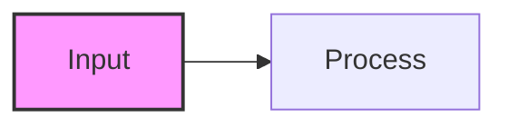
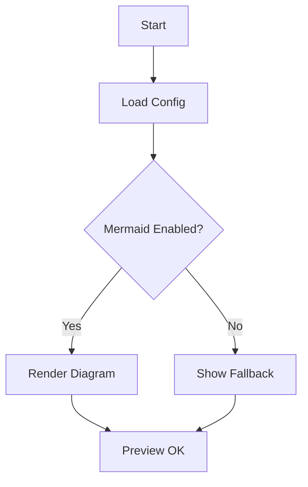

# Markdown Output Standards for Code, Formulas, and Mermaid Diagrams

## 1. Objectives and Scope
This specification aims to provide unified technical standards for AI Agents generating Markdown documentation, ensuring that generated documents render correctly in environments such as VS Code, Jupyter Notebook (ipynb), and GitHub. It specifically focuses on the compatibility and aesthetics of code blocks, mathematical formulas, and Mermaid diagrams.

## 2. Environment Preparation and Recommended Plugins
To obtain the best preview experience, users are recommended to install the following VS Code plugins:
*   **Markdown All in One**: Provides basic features like keyboard shortcuts and table of contents generation.
*   **Markdown Preview Mermaid Support**: Ensures Mermaid diagrams display correctly in the native VS Code preview.
*   **Markdown Preview Enhanced** (Optional): Provides more powerful preview capabilities, supporting KaTeX and Mermaid, often with better rendering results than the native preview.
*   **Jupyter**: If viewing in ipynb, the official Jupyter extension is required to support Notebook rendering.

## 3. Code Output Standards
When outputting code, AI should adhere to the following standards to improve readability (using Google docstring style for code segments, keeping them concise) and maintainability:

### 3.1 Path Indexing and Context
*   **File Paths**: When referencing files, prioritize using **clear relative paths relative to the project root directory** (default) or **absolute paths** (if specifically requested by the user).
*   **Code Location**: When explaining code, explicitly point out the line number range (e.g., `src/main.py:L20-L35`) to facilitate quick navigation for the user.

### 3.2 Key Functions and Explanations
*   **Key Code Segments**: Avoid outputting lengthy and irrelevant full code files. Only display core logic, key functions, or modified fragments.
*   **Comments**: Code blocks should contain concise comments to explain complex logic.
*   **Formula Mapping**: When code implements specific mathematical formulas, explicitly reference the corresponding formula number or name in the code comments or documentation context to establish a "Formula-Code" mapping.

## 4. Mathematical Formula Output Standards
To ensure cross-platform compatibility (VS Code, GitHub, Jupyter), formula output should follow these standards:

### 4.1 Syntax Standards
*   Use **LaTeX** syntax.
*   **Inline Formulas**: Use single dollar signs `$ ... $`.
    *   *Note*: For compatibility, it is recommended **not** to have spaces between the `$` and the formula content (e.g., `$E=mc^2$` instead of `$ E=mc^2 $`).
*   **Block Formulas**: Use double dollar signs `$$ ... $$`.
    *   This is the most universal block-level formula syntax, supported by GitHub and VS Code.
    *   Avoid using `\begin{equation}` unless it is certain that the target environment supports automatic numbering, as some Markdown renderers (like GitHub native) may not support it.

### 4.2 Writing Requirements
*   **Clarity**: Variable names should be descriptive or consistent with code variable names (can be annotated after the formula).
*   **Alignment**: Use the `\begin{aligned} ... \end{aligned}` environment for multi-line derivations to avoid reliance on specific environment alignment methods.

### 4.3 Examples
*   **Inline**: The loss function $L$ is defined as...
*   **Block**:
    $$
    s(q, k) = \langle f_T(q), f_M(k) \rangle
    $$
    $$
    \text{score}(q, k) = w_1 s + w_2 \text{tanimoto} + w_3 \mathbf{1}[\text{SMARTS}]
    $$

### 4.4 References
*   [LaTeX Mathematical Expressions (Overleaf)](https://www.overleaf.com/learn/latex/Mathematical_expressions) - Authoritative LaTeX syntax guide.
*   [Markdown Math Syntax (KaTeX)](https://katex.org/docs/supported.html) - Many Markdown renderers (such as VS Code plugins) use the KaTeX engine.

## 5. Mermaid Diagram Output Standards
Mermaid diagrams often fail to render due to syntax errors or environmental differences. The following specifications aim to resolve these issues.

### 5.1 Syntax Optimization and Compatibility
*   **Avoid HTML Tags**: It is strictly forbidden to use HTML tags like `<br>` in node labels. Newlines cause some renderers to fail. It is recommended to use short ASCII text or split long text into multiple nodes.
*   **Subgraph**: Use the standard syntax `subgraph ID [Title] ... end`.
    *   **ID**: Must be English/Alphanumeric (e.g., `sg1`).
    *   **Title**: Can contain Chinese or other languages, but avoid special symbols.
    *   *Error Example*: `subgraph ChineseTitle` (this will cause parsing errors).
*   **Style Definitions**: Avoid complex `linkStyle` usage, as this easily leads to cross-environment errors.

### 5.2 Layout and Beautification
*   **Initialization Directives**: Add `%%{init: ... }%%` at the top of the diagram to unify themes and font sizes, ensuring visibility across different backgrounds.
    ```mermaid
    %%{init: { 'theme': 'default', 'themeVariables': { 'fontSize': '12px' } } }%%
    ```
*   **Color Distinction**: Use `classDef` to define colors for different node types and apply them after nodes to enhance readability.



*   **Clear Flow**: Ensure the diagram flow (e.g., Left-to-Right `LR` or Top-Down `TD`) is logically clear.

### 5.2.1 Mermaid Test Block


### 5.3 Common Errors and Analysis
*   **Error**: `A[Text<br>Newline]` -> **Correction**: `A[Text Content]` (Keep single line).
*   **Error**: `subgraph ProcessOne` (if strictly non-alphanumeric ID expected) -> **Correction**: `subgraph sg1 [Process One]`.
*   **Error**: Referencing undefined style classes `:::undefinedClass`.

### 5.4 References
*   [Mermaid Official Documentation](https://mermaid.js.org/intro/) - Official syntax guide.
*   [Mermaid Live Editor](https://mermaid.live/) - For testing and validating Mermaid code.

---
*This document was generated with AI assistance and human review, aiming to standardize AI output formats and improve collaboration efficiency.*
