## Abstract
This post consolidates field-tested practices for building production-ready `SKILL` packages. The core idea is to turn scattered procedural knowledge into executable Skill modules, governed by `RULE` constraints, and anchored by a Single Source of Truth under `.agent/`. The result is a repeatable system with explicit Trigger, Input/Output, Parking Point, and Minimal Closed Loop validation.

## One-Sentence Goal
Transform how-to knowledge into callable Rule and Skill units that remain consistent across IDEs and verifiable by design.

## Key Principles from the Records
1. Rules define constraints and quality gates; Skills encode reusable procedures.
2. Use `.agent/` as the single source of truth; IDE-specific paths are only indexes.
3. Every Skill must state trigger, inputs, outputs, parking points, and validation steps.
4. No “empty process”: templates, scripts, or examples are mandatory for execution.
5. Stabilize rules and Skills before scaling; avoid evidence-free refactors.

## End-to-End SKILL BUFF Workflow (Expanded)
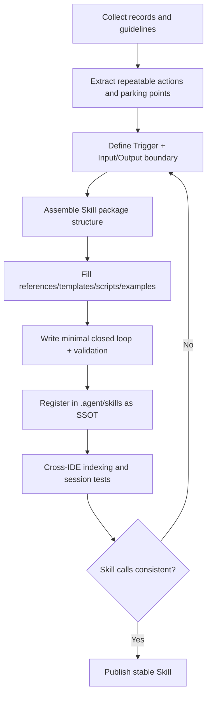

## Production Skill Package Blueprint

Reference Link [AgentSkills](https://agentskills.io/home)

```text
SKILL-NAME/
  ├─ SKILL.md
  ├─ references/
  ├─ templates/
  ├─ scripts/
  ├─ examples/
  └─ resources/
```

## Field-Proven Practices 

(Grounded at the Blueprint Level)
- `SKILL.md` is the control plane; it must declare Trigger, Inputs, Outputs, and Validation.
- `references/` carries formal constraints and style rules to prevent drift.
- `templates/` prevents format ambiguity and makes onboarding deterministic.
- `scripts/` enforce minimal validation and preserve auditability.
- `examples/` provide the smallest runnable slice and reduce interpretation cost.

## Key Tests and Outcomes 

(2026.02.13 Report Must-Haves)

These tests are mandatory context for SKILL BUFF because they validate cross-IDE portability.
1. Cross-IDE session tests confirmed Skill/Rule call consistency.
2. IDE version check established minimum versions: VS Code 1.108.1, Claude Code 2.1.39, Trae 3.5.30, Trae CN 3.3.28, Antigravity 1.15.8.
3. Frontmatter compatibility tests showed that empty fields are cleaned by some IDEs.
4. Typst compatibility tests triggered fixes for table cell `*` escaping.
5. Skill skeleton generation produced three closed-loop packages aligned to the guidance docs.

## Two-Layer Skill Architecture

 (From 2026.02.10 + 2026.02.01)

- Orchestration Layer: defines triggers, interaction, and output contracts.
- Implementation Layer: handles conversion scripts and automation details.
- Example pair: experiment_report_generator → markdown_to_typst_report.

## Mermaid-to-Typst Decision Effect Matrix 

(From 2026.02.11 + 2026.02.10)

The tests compared rendered legibility inside Typst for labels, node text, and table-like blocks, using identical Mermaid sources across formats. SVG runs lost text under htmlLabels and still showed partial loss after disabling htmlLabels, while PNG improved with higher scale and width. The adopted setting (PNG scale=8, width=3000) preserved all labels and avoided blur when printed or zoomed in Typst.

| Group | Format | Params | Result | Decision |
| --- | --- | --- | --- | --- |
| G1 | SVG | scale=2, htmlLabels=true | Text missing | Reject |
| G2 | PNG | scale=3, width=800 | Blurry at scale | Reject |
| G3 | PNG | scale=8, width=3000 | Sharp and stable | Adopt |
| G4 | SVG | scale=2, htmlLabels=false | Partial text loss | Fallback only |
| G5 | PDF | scale=1, width=2000 | Sharp but unstable crop | Reject |

## Expanded Rendering Workflow (Production Choice)

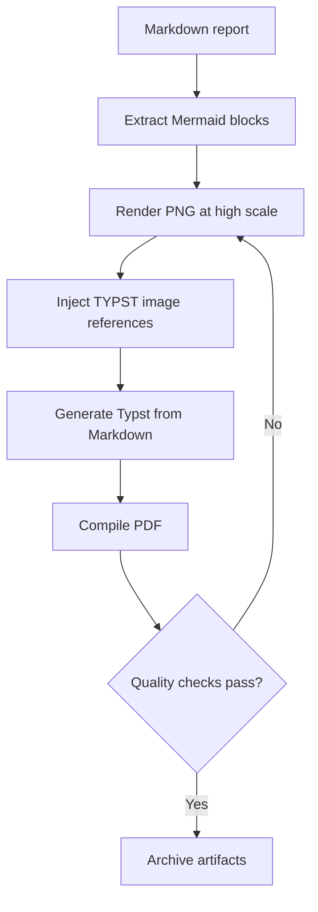
## Implemented Skills: Shared Patterns Details

### dataset-prep
- Inputs: source, schema, resource format, constraints, version.
- Outputs: versioned Parquet and metadata.json.
- Validation: sample checks + schema verification.

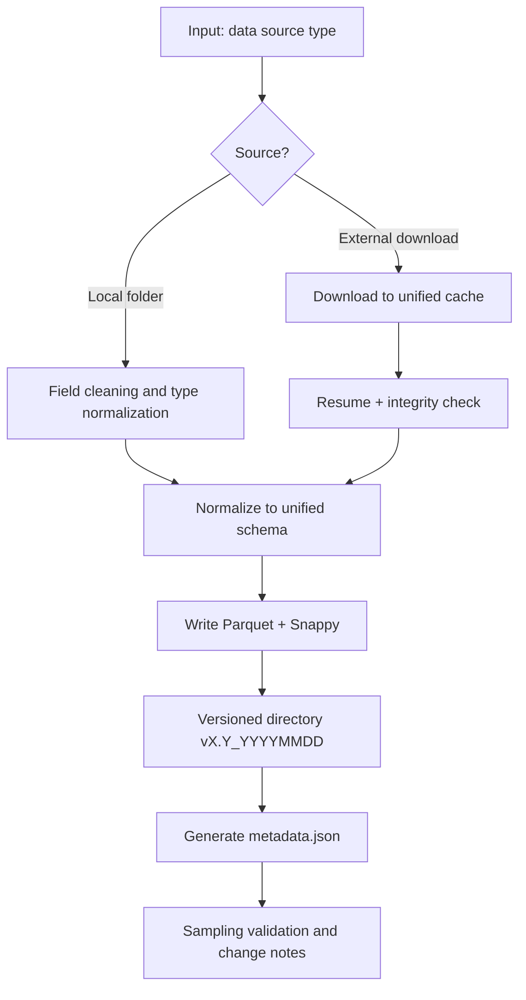

Directory layout
```
skills/dataset-prep/
├── references/
│   └── 数据集准备和文件处理规范（含模板）.md
├── scripts/
│   └── validate_dataset.py
├── templates/
│   ├── dataset_layout.md
│   └── metadata.json
└── SKILL.md
```

### train-closed-loop
- Inputs: objective, data path, entry script, metrics.
- Outputs: configs, logs, and run artifacts.
- Validation: minimal structure check before training.

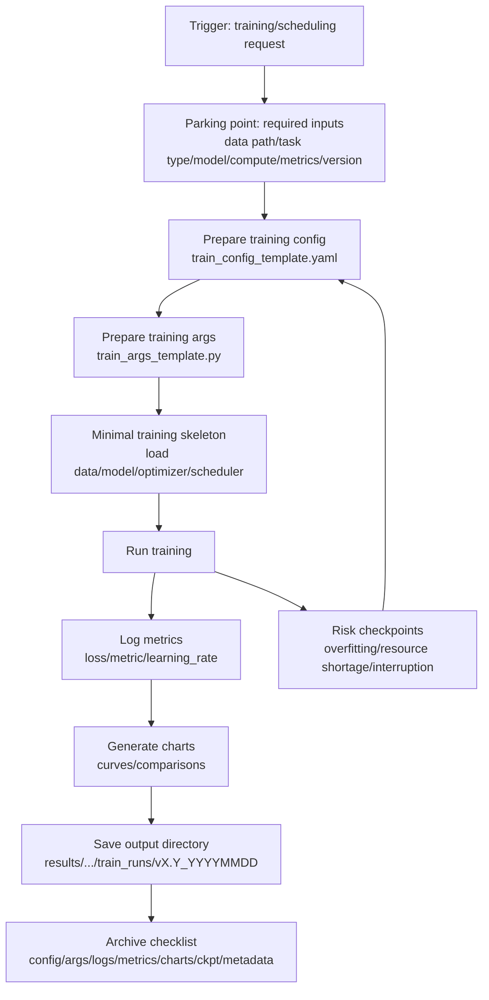

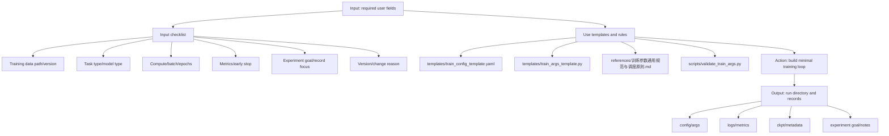

Directory layout
```
skills/train-closed-loop/
├── examples/
│   └── minimal_train_run.md
├── references/
│   └── 训练参数通用规范与调度原则.md
├── scripts/
│   ├── __pycache__/
│   │   └── validate_train_args.cpython-39.pyc
│   └── validate_train_args.py
├── templates/
│   ├── __pycache__/
│   │   └── train_args_template.cpython-39.pyc
│   ├── train_args_template.py
│   └── train_config_template.yaml
└── SKILL.md
```

### visualization-closed-loop
- Inputs: training logs, sample structures, display requirements.
- Outputs: Streamlit pages.
- Validation: data binding plus visual consistency checks.

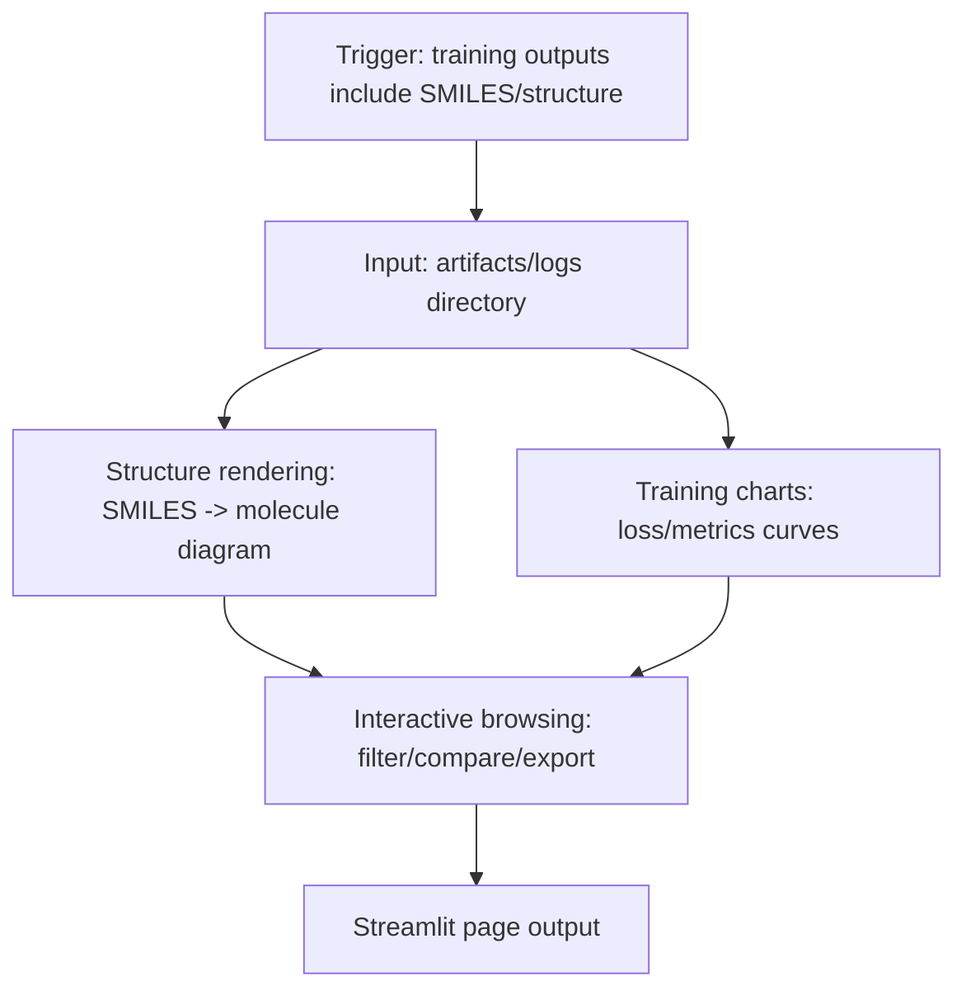

Directory layout
```
skills/visualization-closed-loop/
├── examples/
│   └── demo_dashboard.md
├── references/
│   ├── 化学模型训练可视化与交互工作流streamlit dashbroad网页展示编程框架指南.md
│   └── 化学模型训练可视化与交互工作流模板.md
├── templates/
│   ├── __pycache__/
│   │   ├── data_binding_stub.cpython-39.pyc
│   │   └── page_skeleton.cpython-39.pyc
│   ├── data_binding_stub.py
│   ├── page_skeleton.py
│   └── requirement_form.md
└── SKILL.md
```

### experiment_report_generator
- Inputs: report date range, artifacts, environment info, evidence links.
- Outputs: structured Markdown report with audit-ready sections.
- Validation: required artifacts present and references are real.

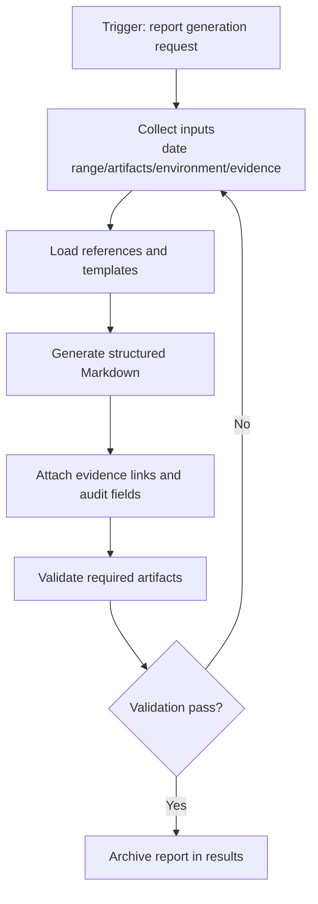

Directory layout
```
.agent/skills/experiment_report/
├── examples/
│   ├── 示例实验报告2026.01.15-RAG向量对齐.md
│   └── 示例实验报告2026.01.15-RAG向量对齐.typ
├── references/
│   ├── notebook_experiment_template.typ
│   └── 代码、公式、Mermaid图的markdown文档输出规范.md
├── resources/
│   └── env_check.typ
├── scripts/
│   ├── get_system_info.ps1
│   └── get_system_info.sh
└── SKILL.md
```

### markdown_to_typst_report
- Inputs: Markdown report, Mermaid blocks, figure paths.
- Outputs: Typst document and compiled PDF.
- Validation: image render success and Typst compile checks.

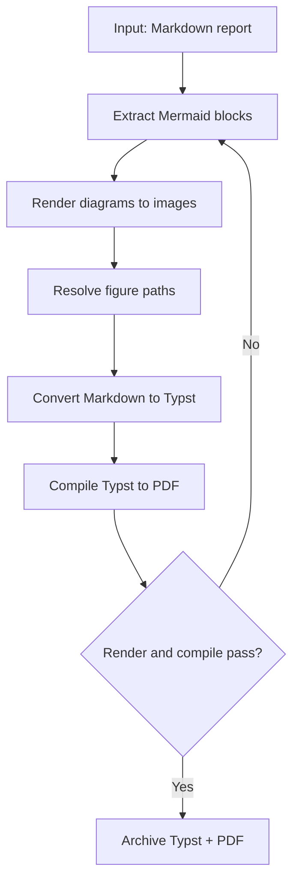

Directory layout
```
.agent/skills/markdown_to_typst_report/
├── examples/
│   ├── input.md
│   └── output.typ
├── references/
│   ├── Markdown转Typst排版与指令规范指南.md
│   ├── Mermaid转图片(PNG_SVG)自动化脚本使用指南.md
│   └── Typst图片插入完整指南-用户学习使用.md
├── resources/
│   ├── mermaid_config.json
│   ├── notebook_experiment_appendix_crop_template.typ
│   ├── notebook_experiment_appendix_nocrop_template.typ
│   └── notebook_experiment_template.typ
├── scripts/
│   └── convert_mermaid_to_image.py
└── SKILL.md
```

### monthly_report_lsh
- Inputs: DOCX template path（with formatting styles and placeholder marks）, month range, draft Markdown, placeholder mapping, logo path.
- Outputs: draft preview Markdown and filled DOCX report.
- Validation: placeholder scan, audit fields, and docx preview checks.

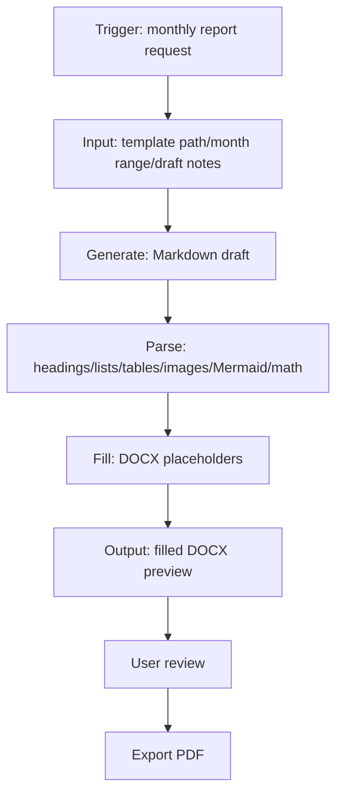

Debug notes (From `results/20260220/todo.md`)
- Issues: header logo placeholder missing, table widths unstable, lists auto-numbered, Mermaid not rendered without mmdc, math blocks only text.
- Fixes: expanded header table scanning, enforced table styles and fixed width, forced Normal style with bullet lists, Mermaid to PNG with mmdc check, Pandoc to OMML with fallback.
- Validation: py_compile check, audit fields review (images/tables/code/math/mermaid counts), leftover placeholder scan.

Directory layout
```
.agent/skills/monthly_report_lsh/
├── examples/
│   └── 月度报告占位符模板草案.md
├── references/
│   └── 代码、公式、Mermaid图的markdown文档输出、DOCX转换规范.md
├── resources/
│   ├── logo.png
│   └── 月度工作汇报模板-脱敏处理.docx
├── scripts/
│   └── fill_docx.py
└── SKILL.md
```

## Minimal Closed Loop Checklist
- Trigger: explicit scenario or keywords.
- Inputs: required fields; missing → parking point.
- Actions: minimum steps to a runnable slice.
- Outputs: named artifacts and directories.
- Validation: script or smallest checks before next step.

## Rule and Skill Hyperlink Mapping

| Platform | Global Rules/Instructions | Project Rules/Instructions | Module Rules/Instructions | Notes |
|---|---|---|---|---|
| VS Code (GitHub Copilot Chat) | Custom instruction settings (no fixed Markdown path) | `.github/copilot-instructions.md` or `AGENTS.md` | `*.instructions.md` | Path depends on settings |
| Claude Code | `~/.claude/CLAUDE.md` | `CLAUDE.md` or `.claude/CLAUDE.md` | Layered or subdirectory `CLAUDE.md` | Global/Project level |
| Trae | `~/trae/user-rules.md` and `~/trae-cn/user-rules.md` | `.trae/rules/` | `.trae/rules/` subfolders | Paths confirmed |
| Antigravity | `~/.gemini/GEMINI.md` | `.agent/rules/` | `.agent/rules/` subfolders | Official docs confirmed |
| Cursor | Rules for AI (created in settings, no official path) | Not confirmed | Not confirmed | Path pending |

### Task Flowchart
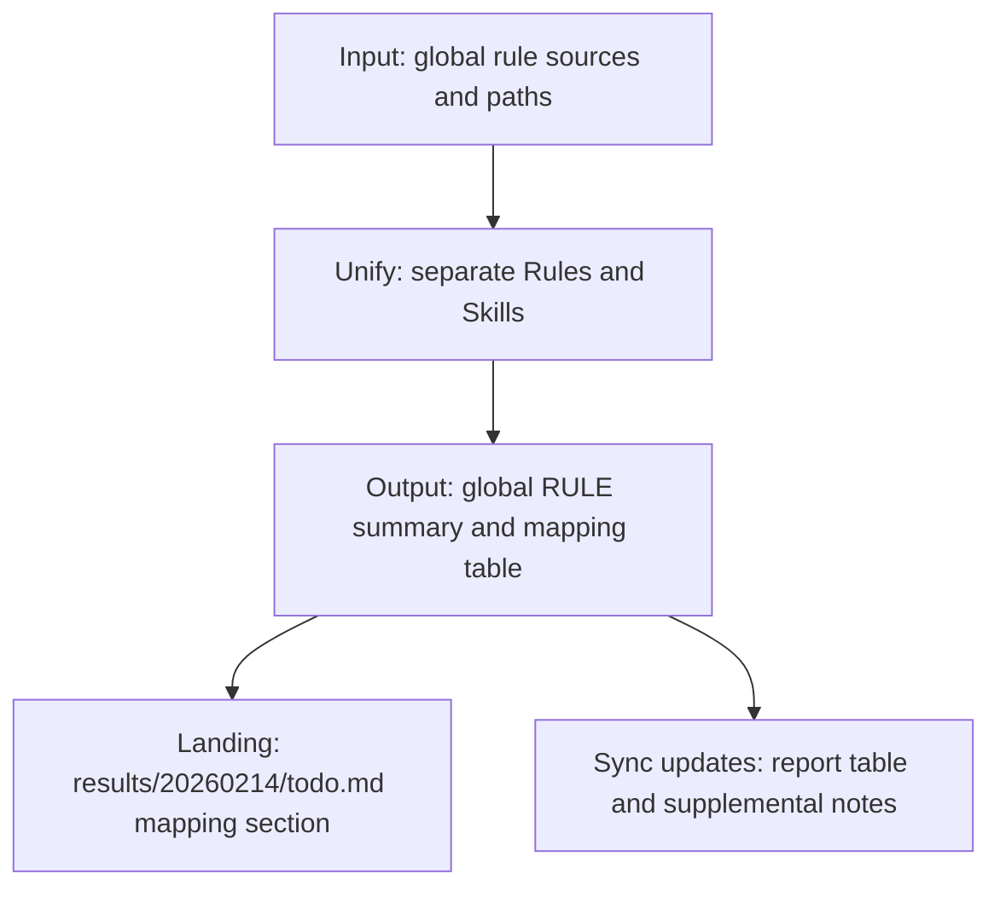

### Strategy Flowchart
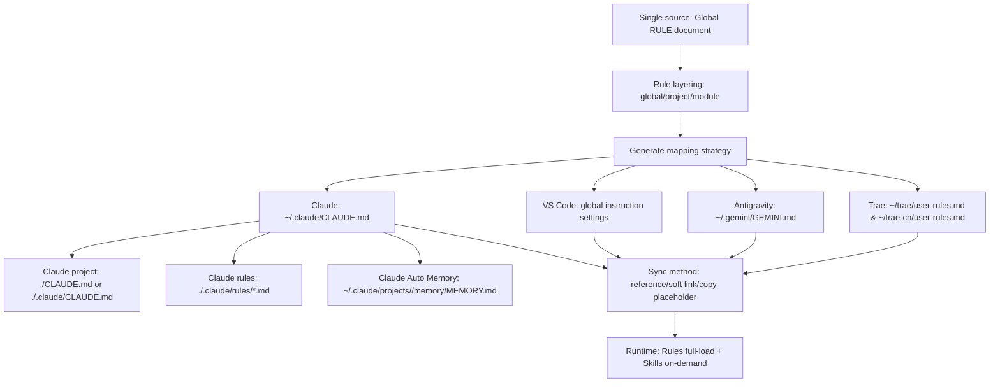

### Recommended Single-File Structure
- The Global RULE document contains cross-IDE common content only:
  - Scope and precedence (global < project < module < task)
  - Interaction/output requirements (language, structure, validation, logging)
  - Change discipline (read-before-write, small steps, minimal change)
  - Security and compliance (no unknown libraries, no secrets)
  - Rule vs Skill division (Rules always loaded, Skills on-demand)
- IDE entry files only keep:
  - A pointer to the Global RULE document
  - Minimal IDE-specific differences (paths, toggles, loading layers)

### Minimal Integration of External Skills
- Confirm license and usage boundaries: structure-only reference is OK; copying content must follow licensing.
- Local adaptation first: map external Skill directories and triggers to project rule layers.
- Small pilot first: choose 1–2 categories (data processing, evaluation, reporting) and validate a minimal loop.
- Keep Rule vs Skill boundaries: Rules for constraints, Skills for process.
- Four-question check: change I/O contracts? replace audit logs? add new dependencies/scripts? only borrow structure/fields?
- Borrow structure and terminology, not execution; do not replace existing result logging.
- Example: reuse field layouts for experiment records without altering report I/O or landing paths.

### Converting a Single Guideline into Rules and Skills

Here is an example.

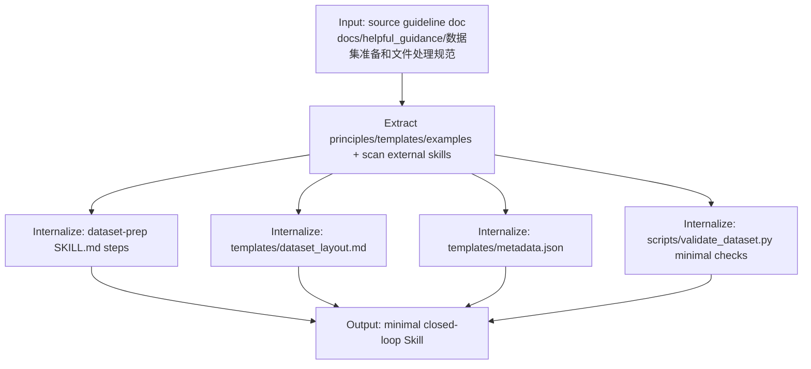

The detailed flows and the package layout are listed in the Implemented Skills section above.
