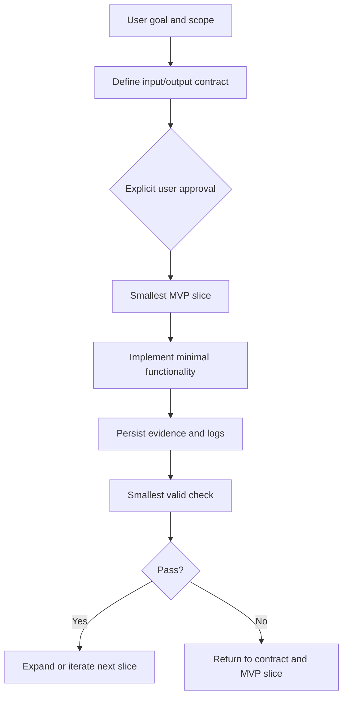

This post distills only the **experience and lessons** from recent February 2026 experiment reports. It focuses strictly on what worked, what failed, and what must change.

# Pros (What Vibe Coding Did Well)

- **Speed of exploration**: Rapid iteration made it possible to test ideas fast and discover high‑impact bottlenecks early, especially in multi‑stage workflows.
- **Idea throughput**: Quick “try‑and‑see” loops helped surface architectural gaps that were invisible in static design documents.
- **Integration discovery**: Fast trial runs exposed where tooling contracts (YAML vs code) diverged, highlighting integration risks early.

# Cons (What Vibe Coding Hurt)

- **Contract drift**: When changes are made by “feel,” **contract‑driven design** gets bypassed. This created mismatches (e.g., YAML fields vs actual tool inputs) that reduced reliability.
- **Hidden false positives**: Soft retrieval or placeholder logic can appear to “work,” but actually hides structural failures (e.g., retrieval returning plausible but non‑conforming candidates).
- **Debugging chaos**: Rapid edits without strict checkpoints caused repeated fixes for the same root problems (data format mismatch, vector normalization, scoring semantics).

# Lessons Learned (Actionable, Non‑negotiable)

- **Single Source of Truth (SSOT) is mandatory**  
  Centralize rules/skills to prevent multi‑IDE drift. Vibe coding cannot scale without a unified rule stack.

- **Hard gates must outrank intuition**  
  “Feels correct” is not evidence. Hard validation (SMARTS, RDKit audits, schema checks) must veto early to avoid false progress.

- **Contracts first, code second**  
  Every rapid experiment should obey stable input/output contracts. When code runs ahead of contracts, later cleanup is more expensive than building it right.

- **Iterate by evidence, not by mood**  
  All loops must leave auditable artifacts (logs, JSON outputs, structured summaries). Without evidence, vibe coding becomes untraceable.

- **Small scope beats full pipeline**  
  Break down large goals into minimal closures (e.g., “scope check” for DKE coverage). This preserves speed **and** prevents chaotic expansion.

- **Tooling must return standardized fields**  
  Normalize at the protocol layer, not in ad‑hoc agent logic. This reduces mapping drift and keeps tests stable.

# MVP Flow (Vibe Coding with Guardrails)



# Verification & Evidence Logging (Minimal Script Recommendation) 

- **Log first**: Every run must write a timestamped log entry.
- **Run summary**: Persist `run_summary.json` with run_id, timestamps, and status.
- **Minimum fields**: Always include `timestamp`, `run_id`, input content, and `version`.

# Coding Rules (Verbatim)

Suitable for IDE based on VSCode

```text
---
alwaysApply: true
trigger: always_on
description: Project-level core rules, always in effect for all conversations
glob:
paths:
---

# Coding rules

## General rules
- Read before write; confirm scope first
- Define input, output, using by mermaid graph and users' clear approval before editing code through clear comments.
- Verify with the smallest valid check to ensure the code works as expected.
- Change one thing at a time, notify reasons to user first, before editing code.
- Stop when uncertain; record the question, and ask user for confirmation.
- Avoid unnecessary object copying or cloning
- Avoid deep nesting; return early
- Use appropriate concurrency control mechanisms

## Code readability
### Naming conventions
- Use meaningful, descriptive names
- Follow project or language naming standards
- Avoid abbreviations and single-letter variables (unless commonly accepted, such as `i` in loops)

### Non-intrusive changes
- Minimize scope and touch only necessary files
- Prefer existing structure and patterns
- Keep changes reversible and easy to review

### Code organization
- Group related code together
- Each function should do only one thing
- Maintain appropriate levels of abstraction

### Comments and documentation
- Comments should explain why, not what
- CLEAR INPUT AND OUTPUT ，CRITERIA FOR CODE COMMENT AT THE TOP OF THE FILE
- Provide clear documentation for public APIs
- Update comments and revisions to reflect code changes at the top of the files

## Performance optimization
### Memory optimization
- Avoid unnecessary object creation
- Release resources that are no longer needed in a timely manner
- Pay attention to memory leak issues

### Computation optimization
- Avoid redundant calculations
- Use appropriate data structures and algorithms
- Defer computation until necessary

### Parallel optimization
- Identify tasks that can be parallelized
- Avoid unnecessary synchronization
- Pay attention to thread safety issues

## AI for Science Rules (Vibe Coding Requirements)

### Role positioning
- **Core service**: Push the mainline scientific objective forward, not side quests
- **Time awareness**: Treat publication timelines as hard constraints
- **Clear boundaries**: Separate "must-validate" from "nice-to-explore"

### Priority principles
1. **Mainline first**: EO assembly > RAG evaluation > marginal proofs
2. **Smallest valid check**: Prove correctness with the smallest possible unit
3. **Fast iteration**: One thing at a time, validate immediately after completion

### Advanced exploration discipline
- **Evidence-first exploration**: Every speculative step must end with a traceable artifact
- **Constraint-first search**: Enforce SMARTS and audit gates before scoring or ranking
- **Model-reality alignment**: Keep vector spaces, encoders, and scoring metrics consistent across stages
- **Failure mode isolation**: Diagnose by isolating one variable per iteration
- **Reproducibility posture**: Prefer controlled MVP slices over full-pipeline demos

### Prohibited actions
- Do not propose marginal tasks unless explicitly requested
- Do not perform architecture refactors without evidence
- Do not distract the user from core objectives


---
Version :2.0
Date: 2026-02-16
Note：
----
```

# Final Takeaway

Vibe Coding (氛围编程) is powerful **only when constrained**.  
Its strengths are speed and discovery; its weaknesses are drift and false confidence.  
The correct posture is **creative exploration inside a hard boundary of contracts, gates, and evidence**.

---

*Sources summarized from February 2026 experiment reports under results/202602.*
