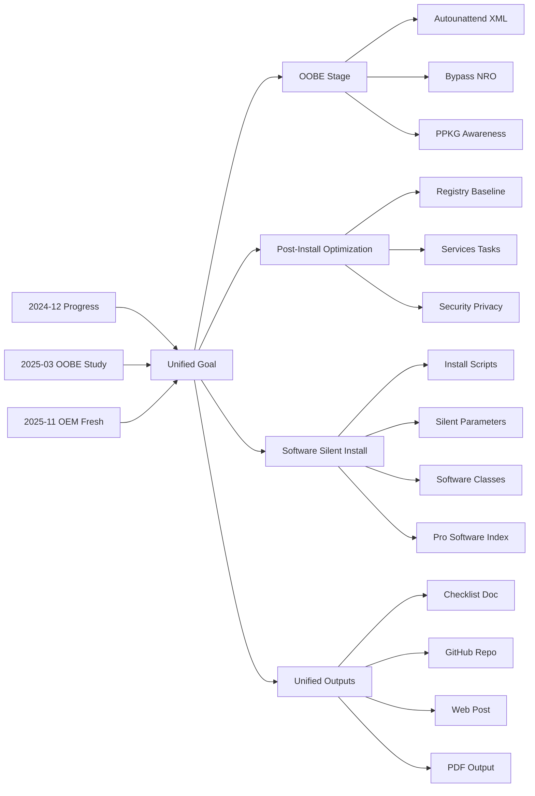

**Silent Install, Unified Control**

**One Protocol, One Output**

## 0. Core Idea

**"Protocolization" and "Low-Level Alignment".**

This guidance defines a unified management system for Windows silent installation and optimization. It treats configuration as Infrastructure as Code (IaC): the simplest scripts produce the most deterministic system state, with full traceability and auditability.

## 1. Unified Management Vision

- **1.1 Why Unified Management**
  - A single protocol governs scripts, documentation, web posts, and PDF output.
  - The blog reflects the final goal and spirit, while code enforces the same standards.

- **1.2 Unified Deliverables**
  - **Checklist Doc**: `checklist_docs_v7.md` is the final output.
  - **GitHub Repo**: scripts, templates, and structured artifacts,will be versioned and released. **COMING　SOON**
  - **Web Post**: this guidance as the public-facing standard. 
  - **PDF Output**: portable, versioned release, based on typst template. **COMING　SOON**

## 2. Project Positioning and Boundaries

### 2.1 Positioning
This project is a **Windows configuration automation toolkit** focused on:

1. **System-Level Configuration Management**
   - Registry optimization (privacy, performance, UI)
   - Services and scheduled tasks
   - Power plans and hardware-related settings
   - Firewall and security policies

2. **OOBE Stage Automation**
   - Unattended installation
   - Bypass forced network and Microsoft account
   - Batch removal of pre-installed apps
   - Region and language automation

3. **Cross-Version Compatibility**
   - Unified registry abstraction for Win7/10/11
   - Home edition enablement (gpedit.msc)
   - OEM activation token migration

4. **Documentation and Traceability**
   - Microsoft Learn trace link for every setting
   - 1:1 alignment between code and docs
   - Transparent auditing (preserve original command outputs)

### 2.2 Out of Scope
1. **Third-Party Software Distribution or Cracking**
   - No installers, no cracks, no pre-packaged third-party software.
   - Only provide general selection principles, silent parameter references, and process diagrams.

2. **Activation Cracking**
   - No KMS servers or activation tools.
   - `sppext` applies only to legitimate OEM licenses for device reinstallation.

3. **Driver Management**
   - No driver bundling or auto-download.
   - Provide migration strategy ideas and priority order only.

4. **Custom OS Images**
   - No modified Windows images (Lite/Optimized editions).
   - Provide only standard Sysprep + DISM documentation.

5. **Proxy/VPN and Censorship Bypass**
   - No proxy tooling or bypass solutions.

6. **Malware or Grey Tools**
   - No malware, trojans, or privacy-invasive tools.
   - All scripts are open and auditable.

### 2.3 Supported Scenarios
1. **Personal Users**
   - New OEM device optimization
   - Fast recovery after reinstall
   - Multi-device consistency

2. **Enterprise Deployment**
   - Batch deployment with standardized configurations
   - Registry/group policy governance
   - Compliance auditing

3. **Dev and Test**
   - VM initialization
   - Standardized dev environments
   - Configuration experiments and rollback

### 2.4 Usage Constraints and Disclaimer
1. **Audience**
   - Requires basic Windows knowledge.
   - Test in VMs before production.
   - Enterprise users should consult IT.

2. **Risk Notes**
   - Registry changes can destabilize systems.
   - Disabling services can impact features (e.g., Windows Update).
   - Home edition gpedit enablement is unofficial and may break after updates.

3. **License Compliance**
   - Users must hold valid Windows licenses.
   - OEM token migration only for same-device reinstall.
   - No commercial redistribution or mass activation.

4. **Support**
   - Community project, no commercial support.
   - Use GitHub Issues for feedback.
   - Microsoft is not responsible for the configurations herein.

## 3. Architecture and Strategy

### 3.1 Dual-Track Deployment

It means the project will provide two main development parallelly and synchronously, to unify an integration of windows silent installation and optimization.

| Stage | Technology | Usage |
|------|---------|---------|
| **Install Stage** | `autounattend.xml` | Automated installation (windowsPE → specialize → oobeSystem) |
| **Optimization Stage** | `BAT scripts` | Post-install registry and feature configuration |

### 3.2 Cross-Version Compatibility
- **Unified Logic**: Registry keys and values cover Windows 7/10/11.
- **Version-Specific**:
  - Win7: Legacy BIOS support, classic control panel priority
  - Win10: Metro settings and classic panel coexistence
  - Win11: UEFI + TPM bypass handling, taskbar alignment adaptations
- **Home Edition Special Handling**:
  - Enable Group Policy Editor (`gpedit.bat`)
  - OEM activation token migration (`sppext`)

### 3.3 Documentation-Driven Development
- **Coding Standard**: `checklist_guidance.md` defines encoding, comments, and function templates.
- **Technical Manual**: `checklist_docs_v7.md` provides bilingual names, full registry paths, Learn links, and compatibility notes.

## 4. Stage Goals

### 4.1 OOBE Stage Goals
- Provide an unattended installation baseline (`autounattend.xml`) aligned with official configuration pass order.
- Enable OOBE bypass strategies and local account readiness.
- Preserve OEM drivers while preventing unwanted pre-provisioned packages when possible.

### 4.2 Windows Silent Install Goals
- Establish a registry baseline for privacy, security, and UX.
- Standardize services/tasks policies and rollback defaults.
- Ensure scripts are auditable and reproducible across versions.

### 4.3 Software Silent Install Goals
- Provide **installation orchestration** and **silent parameter references** only.
- Define **software class taxonomy** and expected status tracking.
- Offer **script templates** and verification criteria for silent installs.
- No software packages, no cracking, no distribution of proprietary installers.

### 4.4 Third-Party Pro Software Index (Redirect Only)
- Provide **navigation-only indexes** that link to separate progress posts and external documentation.
- No inline software payloads or activation instructions in this guidance.
- The redirect list is maintained in Section 7.1 (Post Index and Redirects).

## 5. Protocols and Standards of Checklist Guidance and Coding

### 5.1 Evolution Path from Docx to Markdown/Code
- **Historical context**: WinWord → Pandoc → Markdown (`v6` / `v6_02`) exposed table rendering and fragmentation issues.
- **Target deliverable**: `checklist_docs_v7.md` as the standard release.
- **Enhanced standards**:
  - **Traceability**: Every setting must include a Microsoft Learn link.
  - **Deep interpretation**: Explain the Registry Key, especially for parallel key-value configurations.
  - **Platform compatibility**: Avoid HTML fallback in Markdown tables.

### 5.2 Script/Doc Alignment
- Scripts (`.bat`) and docs (`.md`) mirror each other.
- Registry paths and values must match `reg add` commands.
- Future direction: auto-validate scripts by parsing docs.

### 5.3 Human-AI Collaboration Baseline
- AI must fetch Microsoft Learn links before code changes.
- Any script change must be synced to docs.

### 5.4 Script Encoding and Structure
- **Encoding**: UTF-8 with BOM for all `.bat` scripts.
- **Runtime**: `chcp 65001 >nul` at script header.
- **Bilingual**: If scripts are bilingual, docs must be bilingual.

### 5.5 Header Code
```bat
@echo ---------------------------------------------Attention-----------------------------------------------------
@echo This batch script is only for Windows Optimization after Windows OOBE stage ends.
@echo Codes will be prompted properly with more purposes and parameters, also notes for easily editing.
@echo Press Enter to continue, after understanding codes in this script.
@echo -----------------------------------------------------------------------------------------------------------

openfiles || (
echo Set UAC = CreateObject^("Shell.Application"^) > "%temp%\GetAdmin.vbs"
echo UAC.ShellExecute "%~f0", "", "", "runas", 1 >> "%temp%\GetAdmin.vbs"
"%temp%\GetAdmin.vbs"
exit)
del /f /q "%temp%\GetAdmin.vbs"
pushd "%~dp0"
cd /d "%~dp0"
@echo The batch file got admin right to install in later process. Please wait..
```

### 5.6 Subsection Headers and Comments
```bat
@echo ****************************************************************************
@echo ***** System Locale ********************************************************
@echo ****************************************************************************

REM Internal trace (registry paths only; can include software paths as needed): HKLM\SOFTWARE\Microsoft\InputMethod\Settings\CHS
REM Main setting content, corresponding to the XXXX item in checklist_docs_v7.md.
REM Microsoft Learn trace link: https://learn.microsoft.com/...
```

### 5.7 Registry Operations and Feedback
```bat
:SetReg
:: Parameters: %1=Item name, %2=Path, %3=Key, %4=Type, %5=Value, %6=Meaning
:: Debug: add >nul for minimal output; keep current for audit transparency
reg add "%~2" /v "%~3" /t %~4 /d "%~5" /f 
if %errorlevel% equ 0 (
    @echo [Done] %~1 set to: %~5 (%~6)
) else (
    @echo [Error] %~1 failed, check permissions or path.
)
goto :eof
```

### 5.8 Docs Standards
- **Table rule**: no multi-paragraph content in cells.
- **Metadata**: Summary, [Name], [Registry], [Learn Link].
- **Changelog**: update only when explicitly requested.

## 6. Process Flowchart


## 7. Publication and Navigation

### 7.1 Post Index and Redirects
- Silent installation progress: [Silent Installation Progress 202412](/posts/2024/12/silent_install_guide_windows_progress-202412/)
- OOBE unattended study: [Windows 11 Home oobe unattended study process](/posts/2025/03/windows11_home_oobe_unattended/)
- OEM fresh configuration: [OEM Fresh New LOOK Configuration](/posts/2025/11/OEM%20Fresh%20New%20LOOK%20Configuration-202511/)

### 7.2 Reading Order
1. `checklist_guidance.md` (this protocol)
2. `Docs/checklist_docs_v7.md` (technical handbook for final output)
3. Module BAT scripts (implementation)

## 8. Contribution

1. **Pre-change requirement**: retrieve Microsoft Learn links from `checklist_docs_v7.md`.
2. **Sync obligation**: update docs whenever script logic changes.
3. **Encoding standard**: UTF-8 BOM + `chcp 65001 >nul`.
4. **Function template**: use `:SetReg`.

## 9. References

- [Windows Hardware Compatibility Program](https://learn.microsoft.com/zh-cn/windows-hardware/design/compatibility/)
- [Windows Deployment Options](https://learn.microsoft.com/zh-cn/windows/deployment/)
- [Unattended Windows Setup Reference](https://learn.microsoft.com/en-us/windows-hardware/customize/desktop/unattend/)
- [DISM Imaging Command-Line Options](https://learn.microsoft.com/zh-cn/windows-hardware/manufacture/desktop/dism-image-management-command-line-options-s14)

## 10. License

This project is for learning and research only. All Windows configurations must comply with Microsoft software licensing.

All rights reserved by the author. No part of this article may be reproduced, redistributed, or translated in whole or in part without explicit permission.

See [LICENSE]({{ site.baseurl }}/license/).


## 11. Changelog History

- **2026-02-26**: Restructured guidance and unified goals.
- **2025-12**: Completed Windows_Advanced_Settings_Scripts modular framework.
- **2025-04**: Win11 Unattend V002 development started.
- **2024-11**: Win10 update control solution completed.
- **2020-01**: Project start, Win7 optimization initial version.

---
