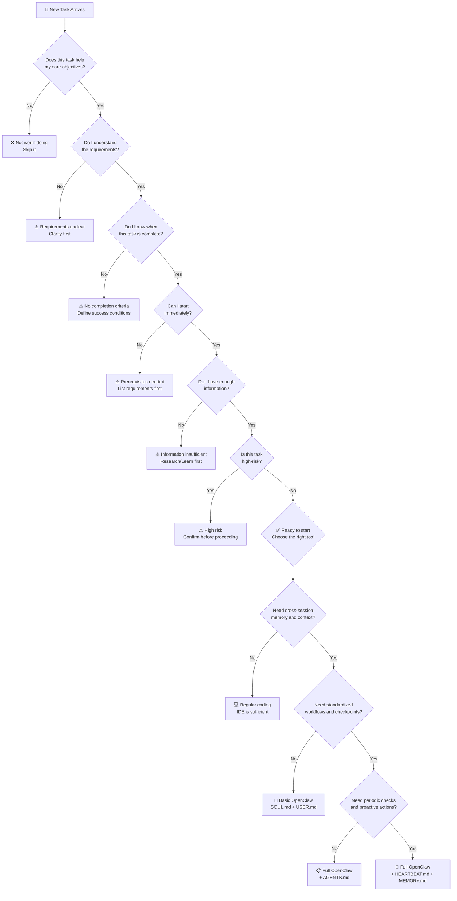
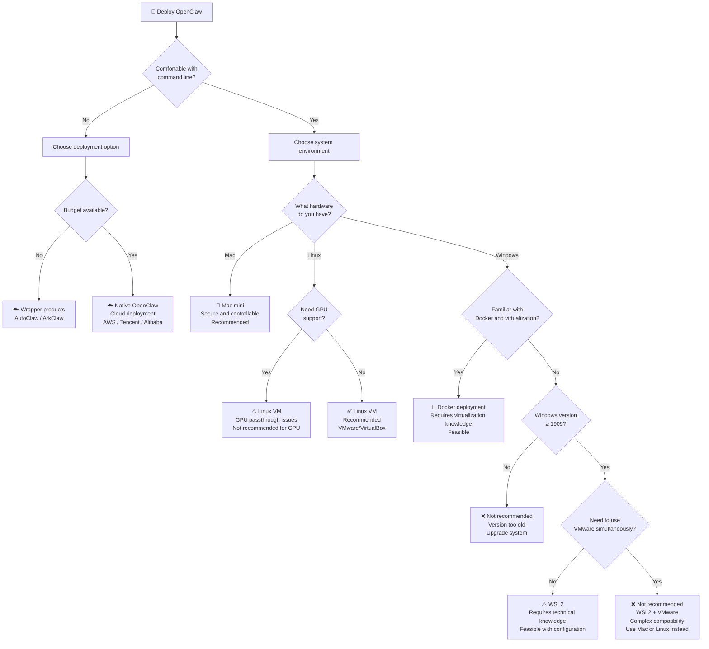
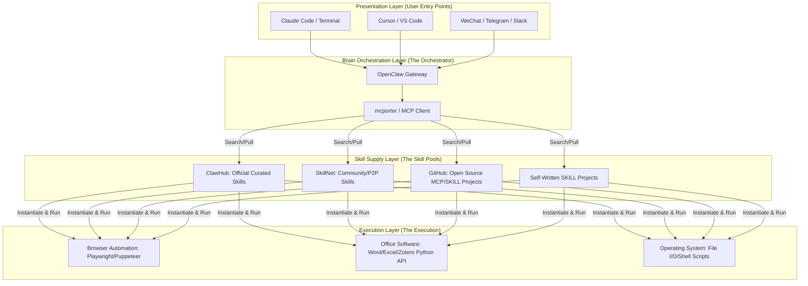
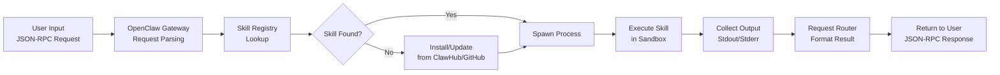
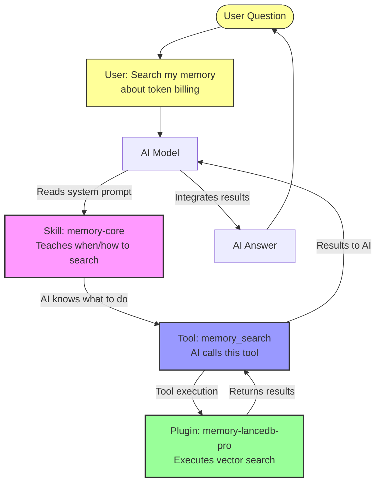
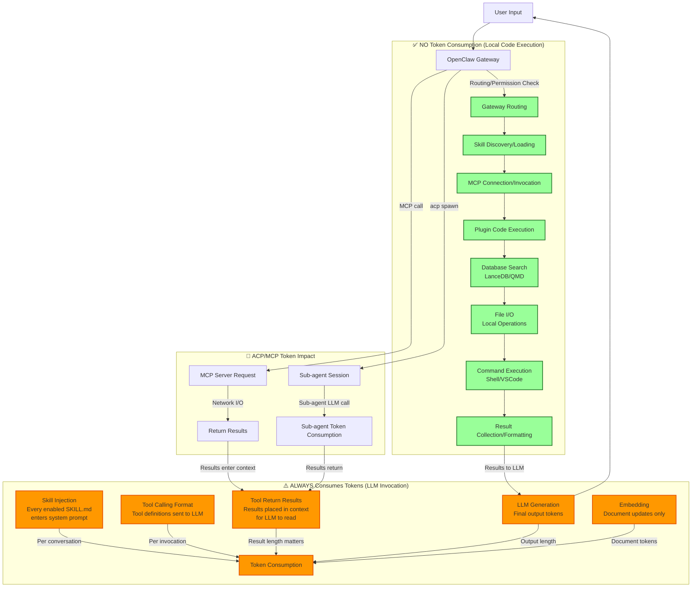
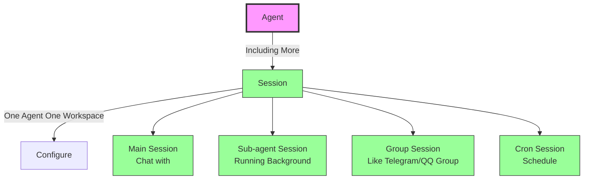

## Abstract

This blog documents my hands-on learning journey with OpenClaw from March 2026, covering deployment decisions, configuration evolution, and architectural principles. Through practical experimentation with WSL2, Docker, and various integration patterns, I've gained deep insights into how OpenClaw orchestrates AI agents, manages skills and tools, and optimizes token consumption. 

This guide aims to help others navigate the complexity of setting up and understanding OpenClaw in production environments.

---

## Introduction

### Why Learn OpenClaw?

OpenClaw represents a paradigm shift in how we think about AI agent orchestration. Unlike traditional chatbots or single-purpose AI tools, OpenClaw provides a comprehensive framework for:

1. **Multi-channel Integration**: Connect to Discord, Telegram, Slack, VSCode, and custom webhooks
2. **Skill-based Architecture**: Compose complex workflows from reusable, well-documented skills
3. **Cross-session Memory**: Maintain context and learning across multiple conversations
4. **Flexible Deployment**: Run locally on WSL2(Compatible with VMWare Existance), Docker, or cloud infrastructure
5. **Token Optimization**: Understand and control where tokens are actually consumed

### My Learning Journey Timeline (March 2026)

Starting from March 3rd, I embarked on a systematic exploration of OpenClaw:

- **Phase 1 (Mar 6)**: Literature Automation Information Collection From Wechat Articles with initial MCP integration trial testing
- **Phase 2 (Mar 8-10)**: Search tool evaluation (Exa vs Tavily) 
- **Phase 3 (Mar 18-21)**: Deep configuration study, memory system setup, architecture understanding of Openclaw Installation，including WSL2 compatibility testing and Ubutun 24 LTS VMware.
- **Phase 4 (Mar 22-24)**: Documentation and knowledge consolidation from Openclaw to further.

This blog captures the key learnings from each phase, organized around five core themes: decision-making frameworks, deployment practices, technology choices, architectural understanding, and configuration evolution, and **safety**

---

## 1. Decision Trees: When and How to Use OpenClaw

### 1.1 When Do You Need OpenClaw?

**Not every task requires OpenClaw.**

**A simiplist code could solve more and more.** 

The decision framework below helps determine if OpenClaw is the right tool for your workflow:



**Key Decision Points:**

1. **Necessity**: Does the task align with your core objectives?
2. **Clarity**: Are requirements and success criteria well-defined?
3. **Readiness**: Do you have all prerequisites and information?
4. **Risk**: Is the task low-risk enough to proceed?
5. **Complexity**: Does it need cross-session memory and standardized workflows?

### 1.2 Deployment Environment Selection

Once you've decided to use OpenClaw, the next critical decision is choosing the right deployment environment:



**Deployment Recommendations:**

| Environment | Pros | Cons | Best For |
|-------------|------|------|----------|
| **Mac mini** | Secure, easy to manage, good performance | Higher cost | Production, long-term stability |
| **Linux VM** | Lightweight, flexible, good for GPU | Requires Linux knowledge | Development, GPU workloads |
| **WSL2** | Free, integrated with Windows, Docker support | Complex setup, compatibility issues | Windows developers, local testing |
| **Docker** | Portable, reproducible, scalable | Requires Docker knowledge | Multi-agent deployments |
| **Cloud** | Scalable, managed infrastructure | Ongoing costs | Large-scale deployments |

---

## 2. Deployment Practice: From Windows Host to WSL2 Architecture

### 2.1 Windows Host and VMware Environment Setup

Before deploying OpenClaw, understanding your host environment is critical.

**Hardware Configuration (My Setup):**
- CPU: Intel Core i7-10700 (8 cores, 16 threads)
- Memory: 32GB DDR4
- Storage: D:\wsl2\ext4.vhdx (virtual disk on D: drive)

**Software Environment:**
- Windows 10 Enterprise 21H2 (Build 19044.1288)
- VMware Workstation 17.5.0 build-22583795
- WSL2 Ubuntu 22.04 LTS
- Docker Desktop 27.4.1 (with WSL2 backend)

**Key Compatibility Note:**
- VMware Workstation 17.5.0+ supports Hyper-V coexistence (required for WSL2)
- Earlier versions (< 17.5.0) have compatibility issues with WSL2
- Upgrade VMware if you encounter "Hyper-V conflict" errors

### 2.2 WSL2 Installation and Configuration

#### Step 1: Enable Windows Features

```powershell
# Enable Virtual Machine Platform and WSL
dism.exe /online /enable-feature /featurename:VirtualMachinePlatform /all /norestart
dism.exe /online /enable-feature /featurename:Microsoft-Windows-Subsystem-Linux /all /norestart

# Restart Windows
Restart-Computer
```

#### Step 2: Install WSL2 Kernel

```powershell
# Download and install WSL2 kernel
wsl --update

# Set WSL2 as default
wsl --set-default-version 2

# Verify installation
wsl --list --verbose
```

#### Step 3: Install Linux Distribution

**Option A: Automatic Installation (if available)**
```powershell
wsl --install -d Ubuntu2204
```

**Option B: Manual Import (Recommended for Offline/Restricted Environments)**

If automatic download fails, manually import a WSL2 distribution:

```powershell
# 1. Download Ubuntu 22.04 LTS image from official source
# Save as: D:\wsl2\Ubuntu2204.tar
# Reference: https://cloud-images.ubuntu.com/wsl/jammy/current/

# 2. Create import directory
mkdir D:\wsl2\Ubuntu2204

# 3. Import the distribution
wsl --import Ubuntu2204 D:\wsl2\Ubuntu2204 D:\wsl2\Ubuntu2204.tar

# 4. Set as default
wsl --set-default Ubuntu2204

# 5. Verify installation
wsl --list --verbose

# 6. Launch WSL2
wsl -d Ubuntu2204
```

[Ubuntu WSL Images](https://cloud-images.ubuntu.com/wsl/jammy/current/) Link To:https://cloud-images.ubuntu.com/wsl/jammy/current/

**Advantages of Manual Import:**
- Works in offline environments
- Full control over installation location
- Can use pre-configured images
- Faster for repeated deployments

#### Step 4: Configure WSL2 Performance

[WSL Config Documentation](https://learn.microsoft.com/zh-cn/windows/wsl/wsl-config) Link To:https://learn.microsoft.com/zh-cn/windows/wsl/wsl-config


Create `.wslconfig` in `C:\Users\<YourUsername>\`:

```ini
[wsl2]
memory=16GB
processors=8
swap=8GB
localhostForwarding=true
vmIdleTimeout=-1
```

**Parameter Explanation:**
- `memory`: Maximum memory WSL2 can use (prevents system slowdown)
- `processors`: CPU cores allocated to WSL2
- `swap`: Virtual memory size
- `localhostForwarding`: Allow Windows apps to access WSL2 localhost
- `vmIdleTimeout=-1`: Never auto-shutdown (set to positive value in minutes if you want auto-shutdown)

#### Step 5: Configure WSL2 Instance

Inside WSL2, edit `/etc/wsl.conf`:

```bash
sudo nano /etc/wsl.conf
```

Add or modify:

```ini
[user]
default=scilab

[interop]
enabled=true

[boot]
systemd=true
```

**Critical Setting:**
- `systemd=true`: **MUST be enabled** for Docker and systemd services. Without this, Docker won't start.

**Apply Changes:**
```powershell
# In PowerShell
wsl --shutdown
wsl -d Ubuntu2204
```

#### Step 6 Optional CUDA Installation

[CUDA Downloads for WSL Ubuntu](https://developer.nvidia.com/cuda-downloads?target_os=Linux&target_arch=x86_64&Distribution=WSL-Ubuntu&target_version=2.0&target_type=deb_network) Link To:https://developer.nvidia.com/cuda-downloads

[CUDA on WSL](https://developer.nvidia.com/cuda/wsl) Link To:https://developer.nvidia.com/cuda/wsl

[CUDA on WSL User Guide](https://docs.nvidia.com/cuda/wsl-user-guide/index.html) Link To:https://docs.nvidia.com/cuda/wsl-user-guide/index.html

```bash
wget https://developer.download.nvidia.com/compute/cuda/repos/wsl-ubuntu/x86_64/cuda-keyring_1.1-1_all.deb
sudo dpkg -i cuda-keyring_1.1-1_all.deb
sudo apt-get update
sudo apt-get -y install cuda-toolkit-13-2
```

[CUDA Keyring Download](https://developer.download.nvidia.com/compute/cuda/repos/wsl-ubuntu/x86_64/cuda-keyring_1.1-1_all.deb) Link To:https://developer.download.nvidia.com/compute/cuda/repos/wsl-ubuntu/x86_64/cuda-keyring_1.1-1_all.deb

```bash
ls /usr/lib/wsl/lib/libcuda.so*
/usr/lib/wsl/lib/libcuda.so  /usr/lib/wsl/lib/libcuda.so.1  /usr/lib/wsl/lib/libcuda.so.1.1
/usr/lib/wsl/lib/nvidia-smi
Sat Mar 21 20:16:31 2026       
+-----------------------------------------------------------------------------+
| NVIDIA-SMI 525.125.05   Driver Version: 529.08       CUDA Version: 12.0     |
|-------------------------------+----------------------+----------------------+
| GPU  Name        Persistence-M| Bus-Id        Disp.A | Volatile Uncorr. ECC |
| Fan  Temp  Perf  Pwr:Usage/Cap|         Memory-Usage | GPU-Util  Compute M. |
|                               |                      |               MIG M. |
|===============================+======================+======================|
|   0  NVIDIA GeForce ...  On   | 00000000:01:00.0 Off |                  N/A |
| N/A   52C    P3     7W /  49W |      0MiB /  6141MiB |      0%      Default |
|                               |                      |                  N/A |
+-------------------------------+----------------------+----------------------+
                                                                               
+-----------------------------------------------------------------------------+
| Processes:                                                                  |
|  GPU   GI   CI        PID   Type   Process name                  GPU Memory |
|        ID   ID                                                   Usage      |
|=============================================================================|
|  No running processes found                                                 |
+-----------------------------------------------------------------------------+
```


### 2.3 VSCode and WSL2 Integration

**Install VSCode WSL Extension:**
1. Open VSCode
2. Install "Remote - WSL" extension (Microsoft)
3. Click "Open Folder in WSL" or use `code .` from WSL terminal

**Connect VSCode to WSL2:**

```bash
# Inside WSL2
code .
```

This opens VSCode connected to your WSL2 environment. All terminal commands run in WSL2 automatically.

**Benefits:**
- Edit files directly in WSL2 filesystem
- Run terminals in WSL2
- Install extensions in WSL2 context
- Seamless development experience

### 2.4 Common WSL2 Issues and Solutions

#### Issue 1: "System has not been booted with systemd"

**Symptom:**
```bash
System has not been booted with systemd as init system (PID 1). Can't operate.
```

**Root Cause:** `/etc/wsl.conf` missing `[boot]` section

**Solution:**
```bash
sudo tee -a /etc/wsl.conf > /dev/null <<EOF
[boot]
systemd=true
EOF

# Restart WSL2
wsl --shutdown
wsl -d Ubuntu2204
```

#### Issue 2: WSL2 Virtual Disk Running Out of Space - Correct Migration Steps

**Symptom:** C: drive fills up, WSL2 becomes slow

**Root Cause:** Default WSL2 installation on C: drive with limited space

**Correct Migration Steps to D: Drive:**

```powershell
# Step 1: Verify current WSL2 location
wsl --list --verbose

# Step 2: Stop all WSL2 instances
wsl --shutdown

# Step 3: Export current WSL2 instance to tar file
wsl --export Ubuntu2204 D:\wsl2\Ubuntu2204.tar

# Step 4: Unregister the original instance from C: drive
wsl --unregister Ubuntu2204

# Step 5: Create target directory on D: drive
mkdir D:\wsl2\Ubuntu2204

# Step 6: Import to new location on D: drive
wsl --import Ubuntu2204 D:\wsl2\Ubuntu2204 D:\wsl2\Ubuntu2204.tar

# Step 7: Set as default
wsl --set-default Ubuntu2204

# Step 8: Verify new location
wsl --list --verbose

# Step 9: Clean up tar file
del D:\wsl2\Ubuntu2204.tar

# Step 10: Launch and verify
wsl -d Ubuntu2204
```

**Verification:**
```powershell
# Check disk usage
Get-ChildItem D:\wsl2\ext4.vhdx | Select-Object Name, Length

# Compress virtual disk if needed
diskpart
select vdisk file="D:\wsl2\ext4.vhdx"
compact vdisk
exit
```

#### Issue 3: WSL2 Auto-Shutdown When Idle

**Symptom:** WSL2 automatically closes after inactivity, losing running processes

**Root Cause:** Default `vmIdleTimeout` setting causes auto-shutdown

**Solution:**

In `.wslconfig`:
```ini
[wsl2]
vmIdleTimeout=-1
```

**Explanation:**
- `-1`: Never auto-shutdown (recommended for development)
- `0`: Shutdown immediately when idle
- `60000`: Shutdown after 60 seconds of inactivity

**Verify Setting:**
```powershell
# Check current configuration
Get-Content $env:USERPROFILE\.wslconfig
```

#### Issue 4: Docker Fails to Start in WSL2

**Symptom:**
```bash
Cannot connect to Docker daemon
```

**Solution:**
```bash
# Check systemd status
systemctl status docker

# Check systemd is running
systemctl --version

# If systemd not running, restart WSL2
wsl --shutdown
wsl -d Ubuntu2204

# Start Docker manually if needed
sudo systemctl start docker
```

#### IMPORTANT: Issue 5: Old WSL CLI vs New WSL2 Architecture - The Critical Mismatch

**The Core Problem:**

Microsoft released two different WSL architectures:

| Architecture | Location | Characteristics |
|---|---|---|
| **Old CLI** | `C:\Windows\System32\wsl.exe` | Built-in to Windows, limited features, supports old Windows 10 versions |
| **New CLI** | `C:\Program Files\WSL\` | Store version, independent updates, supports systemd, requires Windows 10 19044.2364+ |

**How to Detect Old vs New Architecture:**

```powershell
# Check which version you have
wsl --version

# If you get "command not found" or no output → OLD CLI
# If you get version info (e.g., "WSL version: 2.6.3.0") → NEW CLI
```

**The Critical Issue:**

Old CLI has **systemd limitations** that break:
- Docker daemon (requires systemd)
- VNC server (requires systemd services)
- OpenClaw services (requires systemd)
- Any Linux system service

**Symptoms of Old CLI:**
```bash
# systemctl commands fail
systemctl status docker
# Error: System has not been booted with systemd

# Docker won't start
docker ps
# Error: Cannot connect to Docker daemon

# VNC won't start
vncserver :1
# Error: systemd not available
```

**The Solution: Upgrade Windows to 22H2**

This is the **only reliable fix**. Old CLI cannot be upgraded; you must upgrade Windows:

```powershell
# Current version check
winver

# If you see: Windows 10 21H2 (Build 19044.xxxx)
# You need to upgrade to: Windows 10 22H2 (Build 19045.xxxx)

# Download KB5015684 (Feature Update Enablement Package)
# From: https://catalog.s.download.windowsupdate.com/c/upgr/2022/07/windows10.0-kb5015684-x64_523c039b86ca98f2d818c4e6706e2cc94b634c4a.msu

# Or use Windows Update:
# Settings → Update & Security → Check for updates
```

[KB5015684 Download](https://catalog.s.download.windowsupdate.com/c/upgr/2022/07/windows10.0-kb5015684-x64_523c039b86ca98f2d818c4e6706e2cc94b634c4a.msu) Link To:https://catalog.s.download.windowsupdate.com/c/upgr/2022/07/windows10.0-kb5015684-x64_523c039b86ca98f2d818c4e6706e2cc94b634c4a.msu

**After Upgrading to 22H2:**

```powershell
# Verify new CLI is available
wsl --version
# Output: WSL version: 2.6.3.0 (or higher)

# Now you can use new features
wsl --list --online
wsl --install -d Ubuntu2204

# Inside WSL2, systemd will work
systemctl status docker
# Output: ● docker.service - Docker Application Container Engine
```

**Why This Matters:**

- Old CLI = No systemd = No Docker = No OpenClaw = No VNC
- New CLI = Full systemd support = Everything works

### 2.5 Three-Layer Container Architecture Planning

For production deployments with multiple agents and services, design a three-layer architecture:

```
┌─────────────────────────────────────────────────┐
│  Layer 1: MCP Agent Layer                       │
│  - Claude Code Agent (VSCode integration)       │
│  - OpenClaw Agent (Main orchestrator)           │
│  - Literature Retrieval Agent (Search & RAG)    │
├─────────────────────────────────────────────────┤
│  Layer 2: Processing Layer                      │
│  - Data Cleaning Container                      │
│  - Feature Extraction Container                 │
│  - Model Training Container                     │
├─────────────────────────────────────────────────┤
│  Layer 3: Crawler Layer                         │
│  - PubMed Crawler                               │
│  - ChEMBL Crawler                               │
│  - Crossref Crawler                             │
└─────────────────────────────────────────────────┘
```

**Implementation Strategy:**

```bash
# Create isolated Docker network
docker network create --driver bridge openclaw-net

# Layer 1: Start agent containers
docker run --network openclaw-net --name openclaw-agent \
  -e OPENCLAW_CONFIG=/config/openclaw.json \
  openclaw:latest

# Layer 2: Start processing containers
docker run --network openclaw-net --name data-cleaner \
  -v /data:/data \
  data-processor:latest

# Layer 3: Start crawler containers
docker run --network openclaw-net --name pubmed-crawler \
  -e PUBMED_API_KEY=$PUBMED_KEY \
  crawler:latest
```

**Unified User Policy:**
- All containers run as `scilab` user (uid=1000, gid=1000)
- Prevents permission conflicts and file ownership issues
- Simplifies volume mounting and data sharing

**Network Communication:**
- Containers communicate via Docker network DNS
- Agent layer calls processing layer via `http://data-cleaner:8000`
- Processing layer calls crawler layer via `http://pubmed-crawler:8001`

---

## 3. Search Technology Stack Decision

### 3.1 Exa vs Tavily: Comparative Analysis

The search tool selection is critical for the literature retrieval workflow. Two main options emerged from systematic testing in March 2026:

**Exa Search Tool - Completely Free Option:**
- No API key required, completely free
- Returns 8 results by default (configurable)
- Supports multiple search types: web search, code search, research papers
- Parameter format: `key=value` (not JSON)
- Returns LLM-friendly text summaries with title, URL, and content preview

*Experimental Result (Mar 8):*
- Query: "单细胞分析" (Single Cell Analysis)
- Results: 8 papers returned, all highly relevant
- Conclusion: ✅ Production-ready, zero cost

**Tavily Search Tool - AI-Optimized Option:**
- AI-optimized search with relevance scoring (0.98-0.99 range)
- Free tier: 1,000 calls/month
- Paid: $0.025 per call after free tier（Supported **UnionPay**）
- Multiple tools: `tavily_search`, `tavily_extract`, `tavily_crawl`, `tavily_map`, `tavily_research`
- Returns JSON format with relevance scores and raw content

*Experimental Result (Mar 9):*
- Query: "单细胞分析"
- Results: 5 papers returned with high relevance scores (0.989-0.998)
- Extraction capability: Successfully extracted 25 WeChat articles (Mar 10)
- Batch processing: MAX_BATCH_SIZE=10 with 1.5s intervals prevents 30s timeout
- Cost: 2 credits per 5 URLs for advanced extraction
- Conclusion: ✅ High quality, suitable for production with budget consideration

**Comparison Table:**

| Dimension | Exa | Tavily |
|-----------|-----|--------|
| **Cost** | Completely free | $0-25/month (depending on usage) |
| **Search Quality** | Neutral, stable results | AI-optimized, higher relevance |
| **Setup Complexity** | Simple (no API key) | Requires API key |
| **Domestic Availability** | ✅ Available | ✅ Available |
| **Extraction Capability** | Web search only | Search + Extract + Crawl |
| **Recommendation** | ⭐⭐⭐⭐ (Primary) | ⭐⭐⭐ (Backup) |

---

### 3.2 MCP Integration with mcporter

Both search tools are accessed through the MCP (Model Context Protocol) via `mcporter`, a command-line tool that bridges OpenClaw and external services. also, **some IDE** also supports


**What is mcporter?**

mcporter is the MCP protocol's command-line management tool. It handles:
- Parameter conversion (key=value → JSON-RPC 2.0)
- MCP server connection management
- Tool invocation and result formatting
- Can be Utilized in many apps,like VSCode, Claude Code etc.
- HTTP mode and Local Mode use mixed. **I prefer**

**Configuration:**
```bash
# Add Exa MCP server (no API key needed)
mcporter config add exa https://mcp.exa.ai/mcp

# Add Tavily MCP server (requires API key)
mcporter config add tavily "https://mcp.tavily.com/mcp/?tavilyApiKey=YOUR_KEY"

# List available tools
mcporter list exa
mcporter list tavily
```

[Exa MCP Server Documentation ](https://exa.ai/docs/reference/exa-mcp) Link To:https://exa.ai/docs/reference/exa-mcp

[Tavily MCP Server Documentation ](https://docs.tavily.com/documentation/mcp) Link To:https://docs.tavily.com/documentation/mcp

**Tool Invocation:**
```bash
# Exa search (basic)
mcporter call exa.web_search_exa query="single cell analysis"

# Exa search (with parameters)
mcporter call exa.web_search_exa query="..." numResults=5 category="research paper"

# Tavily search
mcporter call tavily.tavily_search query="single cell analysis"

# Tavily extract (for URL content extraction)
mcporter call tavily.tavily_extract urls="[\"https://example.com\"]"
```
\

**Critical Learning - Parameter Format:**

❌ **Wrong (JSON format):**
```bash
mcporter call exa.web_search_exa '{"query": "search term"}'
# Error: MCP error -32602: Input validation error
```

✅ **Correct (key=value format):**
```bash
mcporter call exa.web_search_exa query="search term"
# Success: Returns results
```

This is the MCP protocol standard, not JSON. The lesson: always check `mcporter --help` and official documentation first.

---

### 3.3 Practical Considerations and Experimental Findings

**Challenge 1: WeChat Article Extraction**

*Experimental Finding (Mar 10):*
- Direct crawling via MCP tools fails (WeChat has anti-scraping mechanisms)
- Tavily `tavily_crawl` returns empty results for WeChat URLs
- Root cause: WeChat requires login state and user-agent spoofing

*Solution:*
- Use Browser Relay or Selenium for browser automation
- Maintain login state via cookies/session
- Implement batch processing with rate limiting (1.5s intervals)
- Successfully extracted 25 WeChat articles with 100% success rate

**Challenge 2: API Rate Limiting**

*Experimental Finding (Mar 9):*
- OpenClaw Gateway with 8 concurrent subagents + Tavily API calls → 429 errors
- Root cause: Tavily API rate limiting triggered by concurrent requests

*Solution:*
```json
{
  "agents": {
    "defaults": {
      "maxConcurrent": 1
    }
  }
}
```
Set `maxConcurrent: 1` to prevent concurrent API calls. Trade-off: slower processing, but reliable.

**Search Tool Selection Criteria:**

Based on experimental results, choose your search tool based on:

1. **Budget Priority (Exa)**
   - Use case: Unlimited searches, cost-sensitive projects
   - Recommendation: Primary choice for most workflows
   - Cost: $0/month

2. **Quality Priority (Tavily)**
   - Use case: High-relevance results needed, budget available
   - Recommendation: Backup or premium searches
   - Cost: $0-25/month

3. **Extraction Priority (Tavily)**
   - Use case: Need to extract content from URLs
   - Recommendation: Use Tavily for extraction, Exa for search
   - Cost: 2 credits per 5 URLs


**Recommendation:** Use Scenario 2 (Exa + Tavily Extraction) for optimal cost-quality balance.

**Implementation Workflow:**

```
1. Extract WeChat article URL
   ↓
2. Use Tavily Extract to get article content
   ↓
3. Parse content with LLM to extract keywords
   ↓
4. Use Exa Search with keywords
   ↓
5. Validate results with LLM
   ↓
6. Update literature database
```

---

## 4. OpenClaw Configuration Architecture Understanding

Please refer to Google Agent WHITEBOOK to know how it works. [Google Agent WHITEBOOK](https://www.kaggle.com/whitepaper-introduction-to-agents) Link To:https://www.kaggle.com/whitepaper-introduction-to-agents

Building up YOUR OWN CONCEPT of "AGENT"

### 4.1 Architecture Workflow: The Four-Layer Model

OpenClaw operates as a sophisticated orchestration system with four distinct layers, each handling specific responsibilities in the request-response cycle. Understanding this architecture is crucial for effective deployment and troubleshooting.

#### The Four-Layer Architecture（My Hope AI controlling）



**Layer Responsibilities:**

1. **Presentation Layer**: Multiple entry points where users interact with OpenClaw
   - Direct CLI commands
   - IDE integrations (VSCode, Cursor)
   - Chat platforms (Discord, Telegram, Slack)

2. **Brain Orchestration Layer**: Central decision-making and routing
   - OpenClaw Gateway: Receives requests, manages lifecycle
   - mcporter: Translates between OpenClaw and MCP protocols
   - Request Router: Directs tasks to appropriate skills/tools
   - Skill Registry: Maintains inventory of available skills

3. **Skill Supply Layer**: Knowledge and capability sources
   - ClawHub: Official marketplace with vetted skills
   - Community networks: Peer-to-peer skill sharing
   - GitHub: Open-source implementations
   - Workspace skills: Project-specific custom skills

4. **Execution Layer**: Actual task implementation
   - Browser automation for web interaction
   - Office software APIs for document processing
   - OS-level operations for file and system management

#### Data Flow Through the Layers



**Key Insight**: Each layer is loosely coupled, allowing independent scaling and replacement. For example, you can swap Exa for Tavily search without changing the orchestration layer.

---

### 4.2 Skill vs Tool vs Plugin: The Three-Layer Execution Model

One of the most confusing aspects of OpenClaw is understanding how Skills, Tools, and Plugins interact. They are three distinct concepts that work together seamlessly.

#### Core Definitions

| Concept | Nature | Location | Purpose | Example |
|---------|--------|----------|---------|---------|
| **Skill** | Documentation (Markdown) | `~/workspace/skills/*/SKILL.md` | Teaches AI **when and how** to use tools | `mcporter` skill teaches AI to call MCP tools |
| **Tool** | Interface/Contract | Registered in OpenClaw core | **Bridge between AI and execution** | `memory_search`, `web_search_exa` |
| **Plugin** | Executable Code (TypeScript) | `~/.openclaw/extensions/*` or bundled | **Provides actual functionality** | `memory-lancedb-pro` provides vector search |

#### The Complete Execution Chain



#### Real-World Example: Your Memory Search System

Your current setup demonstrates all three layers working together:

**Skill Layer** (`memory-core` SKILL.md):
```markdown
When the user asks to search their memory, use the `memory_search` tool.
Parameters:
- query: search keywords
- maxResults: maximum results (default 6)
```

**Tool Layer** (OpenClaw core):
- `memory_search`: Registered tool that AI can invoke
- `memory_get`: Retrieve full memory content

**Plugin Layer** (Execution):
- `memory-core`: Core memory functionality (always active)
- `memory-lancedb-pro`: Vector search extension (provides semantic search)
- `qmdbackend`: Full-text search backend (provides keyword search)

**Invocation Flow**:
```
You: "Find my notes about OpenClaw configuration"
  ↓
AI reads memory-core skill → knows to call memory_search
  ↓
AI: memory_search(query="OpenClaw configuration", maxResults=5)
  ↓
OpenClaw routes to memory_search tool
  ↓
Tool calls memory-lancedb-pro plugin → vector search
Tool calls qmdbackend plugin → full-text search
  ↓
Results combined and returned to AI
  ↓
AI integrates results into answer
```

#### Another Example: mcporter + Tavily Search

| Layer | Component | Role |
|-------|-----------|------|
| **Skill** | `mcporter` SKILL.md | Teaches AI how to read `config/mcporter.json` and invoke MCP tools |
| **Tool** | `mcporter_call` | OpenClaw's interface for calling MCP servers |
| **Plugin** | None (external process) | Tavily MCP server runs independently, mcporter connects to it |

**Invocation**:
```
You: "Search for latest lipid protein interaction papers"
  ↓
AI reads mcporter skill → knows to call tavily via mcporter
  ↓
AI: mcporter_call(server="tavily", query="lipid protein interaction")
  ↓
mcporter connects to Tavily MCP server
  ↓
Tavily executes search → returns results
  ↓
Results to AI → AI integrates into answer
```

#### One-Sentence Summary

> **Skill = Manual** (tells AI what to do)
> **Tool = Interface** (how AI calls it)
> **Plugin = Engine** (what actually executes)

---

### 4.3 MCP vs ACP: Protocol Comparison

OpenClaw supports two distinct protocols for extending functionality: MCP (Model Context Protocol) for external services and ACP (Agent Connect Protocol) for isolated agent sessions.

#### MCP: Model Context Protocol

**Purpose**: Connect OpenClaw to external services and tools

**How it works**:
```
OpenClaw → mcporter → MCP Server (Exa/Tavily/Zotero) → External Service
```

**Characteristics**:
- Stateless protocol (each call is independent)
- HTTP-based communication
- External services run in separate processes
- Results returned as structured data
- No token consumption for the MCP call itself (only for result processing)

**Configuration** (in `config/mcporter.json`):
```json
{
  "mcpServers": {
    "exa": {
      "url": "https://mcp.exa.ai/mcp"
    },
    "tavily": {
      "url": "https://mcp.tavily.com/mcp/?tavilyApiKey=YOUR_KEY"
    }
  }
}
```

**Use Cases**:
- Search tools (Exa, Tavily, Brave)
- Document processing (PDF extraction)
- Reference management (Zotero)
- Code analysis
- Any external API

#### ACP: Agent Connect Protocol

**Purpose**: Spawn isolated sub-agent sessions for heavy computational tasks

**How it works**:
```
Main Agent → /acp spawn → Sub-agent Session → Isolated LLM Call → Results → Main Agent
```

**Characteristics**:
- Isolated execution context (separate from main session)
- Each sub-agent has its own LLM invocation
- Useful for long-running or resource-intensive tasks
- Results returned to main session
- **Token consumption**: Sub-agent LLM calls consume tokens independently

**Usage**:
```bash
# Spawn a sub-agent for code development
/acp spawn "Help me implement a Python function for data cleaning"

# The sub-agent runs independently
# When complete, results return to main session
```

**Use Cases**:
- Long-running code generation
- Batch processing
- Parallel task execution
- Heavy computation that shouldn't block main session

#### MCP vs ACP Comparison

| Dimension | MCP | ACP |
|-----------|-----|-----|
| **Protocol Type** | External service connection | Internal agent isolation |
| **Execution Model** | Stateless tool calls | Isolated session with context |
| **Token Consumption** | Only result processing | Full sub-agent LLM calls |
| **Use Case** | Search, APIs, external tools | Heavy computation, batch jobs |
| **Latency** | Network I/O dependent | LLM inference dependent |
| **Isolation** | Process-level | Session-level |

#### Practical Decision Tree

```
Need to call external service?
├─ Yes → Use MCP (Exa, Tavily, Zotero, etc.)
└─ No → Need heavy computation?
    ├─ Yes → Use ACP (/acp spawn)
    └─ No → Direct tool call
```

---

### 4.4 Configuration Evolution: Three Phases

Your OpenClaw journey from March 2026 demonstrates a natural progression through three configuration phases, each building on the previous one.

#### Phase 1: Foundation (Mar 6-10)

**Goal**: Get OpenClaw running with basic LLM integration

**Key Configuration**:
```json
{
  "agents": {
    "defaults": {
      "model": "qianfan/ernie-4.0-8k-latest"
    }
  },
  "gateway": {
    "mode": "local",
    "auth": {
      "mode": "token"
    }
  }
}
```

**What You Achieved**:
- ✅ OpenClaw Gateway startup
- ✅ Basic LLM model configuration
- ✅ mcporter + Exa/Tavily integration
- ✅ MCP protocol validation

**Challenges Encountered**:
- LLM provider configuration errors (missing API keys)
- Parameter format confusion (JSON vs key=value)
- Gateway authentication setup

**Lessons Learned**:
- Always validate configuration with `openclaw config validate`
- Use `openclaw doctor` for automatic fixes
- Check official documentation for parameter formats

#### Phase 2: Multi-Model Integration (Mar 11-21)

**Goal**: Support multiple LLM providers for flexibility and cost optimization

**Key Configuration**:
```json
{
  "models": {
    "providers": {
      "volcengine": {
        "baseUrl": "https://ark.cn-beijing.volces.com/api/v3",
        "apiKey": "${VOLCENGINE_API_KEY}",
        "api": "openai-completions",
        "models": [
          {
            "id": "ark-code-latest",
            "name": "ark-code-latest"
          }
        ]
      },
      "moonshot": {
        "baseUrl": "https://api.moonshot.cn/v1",
        "apiKey": "${MOONSHOT_API_KEY}",
        "api": "openai-completions",
        "models": [
          {
            "id": "kimi-k2-turbo-preview",
            "name": "kimi-k2-turbo-preview"
          }
        ]
      }
    }
  },
  "agents": {
    "defaults": {
      "model": "volcengine/ark-code-latest"
    }
  }
}
```

[Volcengine Coding Plan](https://www.volcengine.com/docs/82379/1925115?lang=zh) Link To:https://www.volcengine.com/docs/82379/1925115?lang=zh

[Moonshot ](https://platform.moonshot.cn/docs/overview) Link To:https://platform.moonshot.cn/docs/overview

**What You Achieved**:
- ✅ Multiple LLM provider support
- ✅ Cost optimization (choose cheaper models for simple tasks)
- ✅ Fallback capability (if one provider fails, use another)
- ✅ Environment variable management

**Challenges Encountered**:
- API key management across providers
- Model ID format differences
- Rate limiting from concurrent requests

**Lessons Learned**:
- Use environment variables for sensitive data
- Test each provider independently before multi-provider setup
- Set `maxConcurrent: 1` to avoid rate limiting

#### Phase 3: Memory System & Automation (Mar 22-25)

**Goal**: Implement cross-session memory and automated workflows

**Key Configuration**:
```json
{
  "plugins": {
    "slots": {
      "memory": "memory-core"
    },
    "entries": {
      "memory-lancedb-pro": {
        "enabled": true,
        "embedding": {
          "provider": "volcengine",
          "model": "embedding-model-id"
        }
      }
    }
  },
  "memory": {
    "qmd": {
      "enabled": true,
      "path": "~/.openclaw/memory"
    }
  }
}
```

**What You Achieved**:
- ✅ Hybrid memory system (full-text + vector search)
- ✅ Automatic session persistence
- ✅ Command logging for audit trail
- ✅ Cross-session context retention

**Challenges Encountered**:
- Embedding API configuration
- Memory slot conflicts (memory-core vs memory-lancedb-pro)
- Token consumption from embedding operations

**Lessons Learned**:
- Embedding only consumes tokens when documents are updated, not during search
- `memory-lancedb-pro` disabled status is normal (it's an extension, not main backend)
- QMD (full-text) + LanceDB (vector) is the recommended hybrid approach

#### Configuration Best Practices

1. **Validation**: Always run `openclaw config validate` after changes
2. **Backup**: Use `openclaw backup create` before major changes
3. **Environment Variables**: Store sensitive data in `.env` or system environment
4. **Incremental**: Add features one at a time, test each before proceeding
5. **Documentation**: Keep notes on why each configuration choice was made

---

### 4.5 Token Consumption: Understanding Where Tokens Are Actually Consumed

This is perhaps the most misunderstood aspect of OpenClaw. Many users worry that the complex architecture will cause token explosion, but the reality is more nuanced. Only specific operations consume tokens; most of the orchestration is local computation.

#### The Token Consumption Flowchart



#### What Consumes Tokens

**1. Skill Injection (Biggest Daily Cost)**

Every enabled skill's `SKILL.md` is injected into the system prompt at the start of each conversation.

**Official Formula** (from OpenClaw docs):
```
total_characters = 195 + Σ(97 + len(name) + len(description) + len(location))
Rough estimate: ~4 chars per token (OpenAI-style)
```

**Your Current Cost** (12 enabled skills):
- Base overhead: 195 chars ≈ 49 tokens
- Per skill average: ~147 chars ≈ 37 tokens
- 12 skills × 37 = 444 tokens
- Plus full SKILL.md content: ~1500-2000 tokens
- **Total per conversation: ~2000-2500 tokens**

**Optimization Strategy**:
- Disable rarely-used skills: `enabled: false` in config
- Use `disable-model-invocation: true` for skills you only call explicitly
- Only enable skills relevant to current task

**2. Tool Calling Format**

When AI decides to call a tool, the tool definition is sent to the LLM:
```json
{
  "name": "memory_search",
  "description": "Search memory for relevant information",
  "parameters": { ... }
}
```

**Cost**: ~50-100 tokens per tool call

**3. Tool Return Results**

Results from tools are placed back into the context for LLM to read:
```
Tool returned: [
  { title: "...", content: "..." },
  { title: "...", content: "..." }
]
```

**Cost**: Proportional to result length
- Short result (100 chars): ~25 tokens
- Long result (1000 chars): ~250 tokens

**Optimization**: Limit result size, summarize before returning

**4. LLM Generation**

The final output tokens are counted:
```
AI: "Based on your memory, here's what I found..."
```

**Cost**: Every output token counts

**5. Embedding** (Memory System Only)

When you add documents to memory, they're embedded for vector search:
```
Document: "OpenClaw configuration guide..."
Embedding: [0.123, 0.456, ...]
```

**Cost**: Document tokens consumed once during update
**Search**: No token consumption (local vector math)

#### What Does NOT Consume Tokens

| Operation | Why |
|-----------|-----|
| **MCP calls** | External service computation, not LLM |
| **Database searches** | Local vector/text operations |
| **File I/O** | Operating system operations |
| **Shell commands** | External process execution |
| **Plugin code** | TypeScript execution, not LLM |
| **Gateway routing** | Internal logic, no LLM |
| **Skill discovery** | File system lookup |

#### ACP vs MCP Token Impact

**MCP (External Service)**:
```
OpenClaw → mcporter → Tavily Search → Results
                                        ↓
                                   Enter context
                                        ↓
                                   Consume tokens
```
- MCP call itself: 0 tokens
- Result processing: tokens consumed

**ACP (Sub-agent)**:
```
Main Agent → /acp spawn → Sub-agent LLM call → Consume tokens
                                                    ↓
                                            Results return
                                                    ↓
                                            Enter main context
                                                    ↓
                                            Consume more tokens
```
- Sub-agent LLM: tokens consumed
- Result integration: tokens consumed again

**Conclusion**: ACP is more expensive than MCP because it involves full LLM invocation

#### Real-World Example: Your Literature Search Workflow

```
1. User: "Search for papers on lipid protein interaction"
   Tokens: 0 (user input, no LLM yet)

2. AI reads mcporter skill
   Tokens: ~300 (skill injection)

3. AI decides to call tavily_search
   Tokens: ~50 (tool definition)

4. mcporter calls Tavily MCP server
   Tokens: 0 (external service)

5. Tavily returns 5 papers
   Tokens: ~200 (results in context)

6. AI reads results and generates answer
   Tokens: ~150 (output generation)

Total: ~700 tokens
```

**If you used ACP instead**:
```
1-3. Same as above: ~350 tokens

4. Spawn sub-agent for search
   Tokens: 0 (process management)

5. Sub-agent LLM call to analyze search strategy
   Tokens: ~400 (sub-agent LLM)

6. Sub-agent calls Tavily
   Tokens: 0 (external service)

7. Sub-agent processes results
   Tokens: ~200 (sub-agent processing)

8. Results return to main agent
   Tokens: ~200 (main agent reads results)

9. Main agent generates final answer
   Tokens: ~150 (output)

Total: ~1300 tokens (85% more expensive!)
```

#### Token Optimization Checklist

- [ ] Disable unused skills (`enabled: false`)
- [ ] Use `disable-model-invocation: true` for rarely-called skills
- [ ] Limit MCP result sizes (e.g., `numResults=5` instead of 20)
- [ ] Summarize long results before returning to LLM
- [ ] Use ACP only for truly heavy tasks, not simple searches
- [ ] Cache embedding results (search doesn't re-consume tokens)
- [ ] Monitor skill injection cost with `openclaw status --usage`

#### Official Documentation

Token impact details: [OpenClaw Skills Token Impact](https://docs.openclaw.ai/tools/skills#token-impact-skills-list) Link To:https://docs.openclaw.ai/tools/skills#token-impact-skills-list

---

### 4.6 Agent vs Session: Understanding Isolation and Persistence

One of the most important architectural concepts in OpenClaw is the distinction between **Agent** and **Session**. These are often confused, but they serve fundamentally different purposes in the system.

NOTE: Differ from the concept of GOOGLE AGENT WHITEBOOK. ATTENTION!

#### Core Concepts



#### Definitions

| Concept | Meaning | Scope | Example |
|---------|---------|-------|---------|
| **Agent** | An independent working instance with its own workspace, configuration, and skills | Persistent across sessions | Your `main` agent is one instance |
| **Session** | A single conversation within an agent, with isolated context and history | Temporary, can be reset | Each `/new` command creates a new session |

**One-sentence summary:**
- **Agent = Person** (an independent assistant with its own personality and workspace)
- **Session = Conversation** (one chat with that person; reset it and you start fresh)

#### Session Isolation and Design

**1. Isolation Mechanism**

Different sessions are completely isolated from each other:
- **Different channels + different users** = different sessions (security by default)
- **Same channel + same user** = same session (continuity)
- **Sub-agent tasks** = isolated sessions (don't block main conversation)
- **Cron jobs** = isolated sessions (scheduled, independent)

Your current configuration:
```json
{
  "session": {
    "dmScope": "per-channel-peer"
  }
}
```

This means:
- ✅ Each Discord channel has its own session
- ✅ Each Telegram user has their own session
- ✅ Privacy is protected (no cross-user context leakage)
- ✅ Suitable for multi-user deployments

**2. Session Lifecycle**

```
Session Created → Active Conversation → Idle/Timeout → Auto-Reset
                                            ↓
                                    (or manual /new)
```

**Default behavior:**
- Sessions auto-reset at 4 AM daily
- Idle timeout: configurable (default: never)
- Manual reset: `/new` or `/reset` command

**3. Session Persistence**

With `session-memory` hook enabled:
```bash
# Automatic session saving
/new → triggers session-memory hook → saves to ~/.openclaw/memory/YYYY-MM-DD.md
```

This allows you to:
- Review past conversations
- Resume context from previous sessions
- Maintain learning across resets

#### Agent Configuration and Session Common Questions


**Q: I ran `/new`, did my agent change?**
A: No. Your agent stays the same (`main`). Only the session changed—your context was cleared.

**Q: When do I need multiple agents?**
A: Multiple agents are useful for:
- Different projects with separate workspaces
- Multi-tenant deployments (each user gets their own agent)
- Different configurations (one agent for coding, one for research)

**Q: What's the relationship between agent and memory?**
A: Memory is **per-agent**, not per-session:
- All sessions within an agent share the same memory
- When you `/new`, context clears but memory persists
- This is why `session-memory` hook is useful—it saves session context before reset

**Q: Can I have multiple sessions in one agent at the same time?**
A: Yes, through:
- **Different channels** (Discord #channel1 vs #channel2)
- **Different users** (User A vs User B)
- **Sub-agents** (`/acp spawn` creates isolated session)
- **Cron jobs** (scheduled tasks run in isolated sessions)

#### My Current Setup

**Agent**: `main`
- Configuration: Multi-model support (volcengine, moonshot, kimi, glm)
- Memory: Hybrid (QMD full-text + LanceDB vector)
- Skills: 12 enabled skills
- Plugins: memory-core, memory-lancedb-pro, qmdbackend

**Session**: `main` (current)
- Scope: `per-channel-peer` (isolated by channel/user)
- Memory: Shared with agent
- Context: Cleared on `/new`
- Hooks: session-memory (auto-save), command-logger (audit trail)

**When you chat with me today:**
- Agent = `main` (unchanged)
- Session = `main` (fresh, or continuing from earlier)
- Memory = Shared across all sessions in this agent
- Context = Isolated to this session

#### Best Practices

1. **Use agent-level configuration** for settings that apply to all sessions
2. **Use session-level settings** for temporary overrides (e.g., `/model switch`)
3. **Enable session-memory hook** to preserve context across resets
4. **Understand isolation** to prevent accidental context leakage in multi-user scenarios
5. **Monitor session lifecycle** with `openclaw status` to see current session info

#### Official Documentation

Session concepts: [OpenClaw Session Concepts](https://docs.openclaw.ai/concepts/session) Link To:https://docs.openclaw.ai/concepts/session

## 5. Practical Implementation & Lessons Learned Collections

### 5.1 Memory Search System: From Zero to Hybrid Architecture

This section documents the complete evolution of your memory system from March 6 to March 25, 2026—a 19-day journey from "no memory" to "production-ready hybrid search."

Timeline Overview

```
Mar 6-10 (Phase 1)     Mar 11-21 (Phase 2)     Mar 22-25 (Phase 3)
   ↓                        ↓                         ↓
No Memory System    →   Basic Config      →    Hybrid Memory
Gateway startup         Multi-model LLM         QMD + LanceDB
MCP integration         API key management      Embedding setup
                        Rate limiting           Hooks automation
```
 Memory Slot Conflict (Mar 20)

**Symptom**:
```
Config warnings:
- plugins.entries.memory-lancedb-pro: plugin disabled
  (memory slot set to "memory-core") but config is present
```

**Initial Reaction**: "Is my configuration broken?"

**Diagnosis Process**:
1. Ran `openclaw plugins list | grep -i memory`
2. Checked plugin documentation
3. Tested memory search functionality
4. Verified search results were working correctly

**Root Cause**: Misunderstanding of memory slot architecture. The warning was informational, not an error.

**Solution**: Accept the warning as normal. The hybrid system (QMD + LanceDB) works as designed.

**Lesson**: Warnings ≠ Errors. Understand the architecture before assuming something is broken.


### 5.2 Configuration Backup & Recovery Strategy

Throughout your experimentation, configuration changes accumulated. Here's the backup strategy you should have implemented:

#### Backup Before Major Changes

[OpenClaw Backup CLI](https://docs.openclaw.ai/cli/backup#backup) Link To:https://docs.openclaw.ai/cli/backup#backup

```bash
# Create backup
openclaw backup create --output ~/Openclaw-20260324-Backup
# Verify
openclaw backup verify ~/Openclaw-20260324-Backup
```

#### Configuration Validation Common

Before and after any configuration change **Main Command** 

[OpenClaw Gateway Configuration](https://docs.openclaw.ai/gateway/configuration) Link To:https://docs.openclaw.ai/gateway/configuration

```bash
openclaw configure
openclaw config validate
openclaw doctor
```

### 5.3 Heartbeat

[OpenClaw Heartbeat Config Reference](https://docs.openclaw.ai/gateway/configuration-reference#agents-defaults-heartbeat) Link To:https://docs.openclaw.ai/gateway/configuration-reference#agents-defaults-heartbeat

[OpenClaw Heartbeat Prompt](https://docs.openclaw.ai/gateway/heartbeat#what-the-heartbeat-prompt-is-for) Link To:https://docs.openclaw.ai/gateway/heartbeat#what-the-heartbeat-prompt-is-for

[OpenClaw Cron Jobs](https://docs.openclaw.ai/automation/cron-jobs#lightweight-bootstrap-context) Link To:https://docs.openclaw.ai/automation/cron-jobs#lightweight-bootstrap-context

```json
{
  agents: {
    defaults: {
      heartbeat: {
        every: "30m", // default: 30m (0m disables)
        model: "anthropic/claude-opus-4-6",
        includeReasoning: false, // default: false (deliver separate Reasoning: message when available)
        lightContext: false, // default: false; true keeps only HEARTBEAT.md from workspace bootstrap files
        isolatedSession: false, // default: false; true runs each heartbeat in a fresh session (no conversation history)
        target: "last", // default: none | options: last | none | <channel id> (core or plugin, e.g. "bluebubbles")
        to: "+15551234567", // optional channel-specific override
        accountId: "ops-bot", // optional multi-account channel id
        prompt: "Read HEARTBEAT.md if it exists (workspace context). Follow it strictly. Do not infer or repeat old tasks from prior chats. If nothing needs attention, reply HEARTBEAT_OK.",
        ackMaxChars: 300, // max chars allowed after HEARTBEAT_OK
      },
    },
  },
}
```

openclaw config set agents.defaults.heartbeat.every "2h"

openclaw config set agents.defaults.heartbeat.lightContext "true"


### 5.4 Openclaw Browser Instance

[OpenClaw Browser Linux Troubleshooting](https://docs.openclaw.ai/tools/browser-linux-troubleshooting) Link To:https://docs.openclaw.ai/tools/browser-linux-troubleshooting

```bash
sajim@scilab:~$ which google-chrome
/usr/bin/google-chrome
sajim@scilab:~$ which chrome
sajim@scilab:~$ openclaw config set browser.headless false

🦞 OpenClaw 2026.3.13 (61d171a) — Alexa, but with taste.

│
◇  
profile: openclaw
enabled: true
running: false
transport: cdp
cdpPort: 18011
cdpUrl: http://127.0.0.1:18789
browser: unknown
detectedBrowser: custom
detectedPath: /usr/bin/google-chrome
profileColor: #FF4500
sajim@scilab:~$ openclaw browser --browser-profile openclaw start
```

## 6. my sincere IMPORTANT NOTICE 

Only Refer to Official Docs, Keep Updated Version Of OpenClaw

1. You MUST find options,parameters from **ONLY Offical Docs [OpenClaw Docs https://docs.openclaw.ai ](https://docs.openclaw.ai)**
, DO NOT FOLLOW ANY INSTRUCTION FROM *Wechat Articles/Bilibili/Rednote/douyin from any Chinese translation source.*

2. YOU CAN ASK AI with specific link with **ONLY Offical Docs [OpenClaw Docs https://docs.openclaw.ai](https://docs.openclaw.ai)** before you act or operate with any uncertainty and 
REMEMBER BACKUP STEPS　and SETTINGS by yourself, not AI does.

3. Remember to focus your **token consumption**. DO NOT Engaging ANY SHORT PERIOD PROMOTION discount BY LLM　PROVIDER,especially in CN.

4. Security Mention,KEEP UPDATED IN TIME.
Setting up with parking point with critical opeation occurs

5. STEP BY STEP PRACTICE, STEADY LEARNING. 
　　
