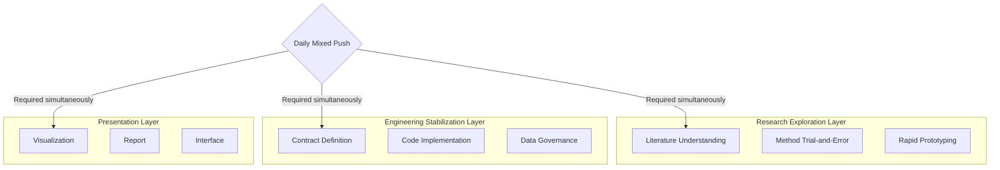
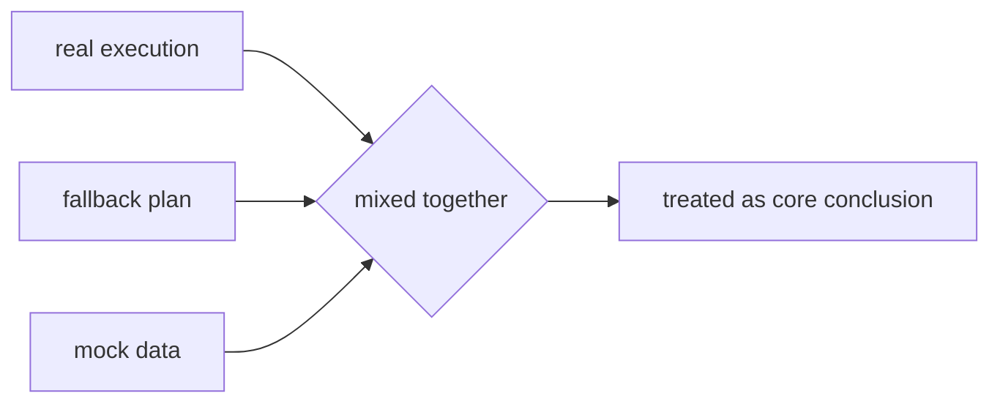
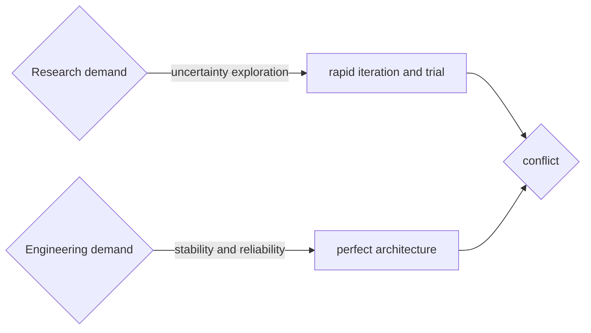
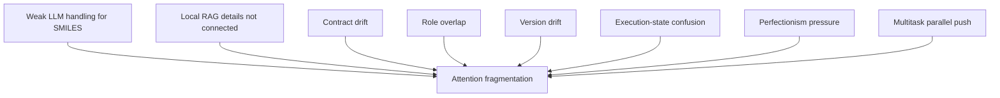
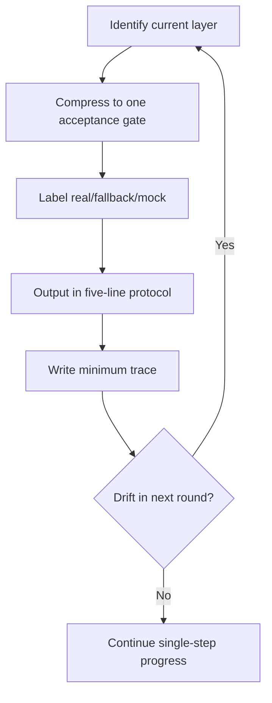

# AI Collaboration Burden Reduction in Practice: My Original Experience and Training Process

## Why I Always Felt "I Was Making Progress" but Could Not Stabilize It

I was pushing three layers at the same time:

- <span style="color: red;">**Research exploration layer**</span> literature understanding, method trial-and-error, rapid prototyping.
- <span style="color: red;">**Engineering stabilization layer**</span> contract definition, code implementation, data governance.
- <span style="color: red;">**Presentation/output layer**</span> visualization, reporting, interface expression.

At that time, I was requiring three things to be true every single day:
- The research narrative must be <span style="color: red; text-decoration: underline;">innovative and literature-backed.</span>
- The engineering implementation must have <span style="color: red; text-decoration: underline;">architecture and coding discipline.</span>
- The presentation must be <span style="color: red; text-decoration: underline;">publishable, readable, and deliverable.</span>



The outcome, exactly as in the original record: I touched everything, stabilized nothing, and never formed a real closed loop.

The second key issue was missing boundaries. I mixed `real / fallback / mock`, which created two typical misjudgments:
- Treating `mock` results as core conclusions.
- Treating `fallback` as "already completed."



The third issue was cognitive overload. My subjective feeling was: **I was busy every day, but could not clearly state what I had actually finished**. Task boundaries kept drifting. New ideas kept cutting in. Attention was constantly fragmented.

The fourth issue was structural conflict: one side demanded uncertain exploration, while the other demanded engineering perfection and stability; one side demanded fast iteration, while the other demanded rigorous architecture. These rhythms are naturally conflicting, yet I had been running them at the same intensity on the same day.



The fifth issue was system-level risk exposed in AI collaboration:
- LLM instability for structure-like strings.
- Local RAG details not fully connected.
- Repeated contract drift, role overlap, and version drift.
- Execution-state confusion plus perfectionism pressure.
- Multi-track execution without clear priority.



My biggest takeaway from this section:
Progress was slow not because I did not work hard, but because I forced mutually conflicting goals into the same round.

## How I Started Turning "Chaos" into "Layered Collaboration"

<span style="color: red;">*The core here was not "writing more rule files." It was splitting responsibilities by rule layer*, so the same constraint would not be duplicated across multiple entry points. *In short, make you clear about what AI did in detail.*</span>

I did not finish it in one shot. I converged step by step along the revision history of global `~/.codex/AGENTS.md`:
- `2026-04-14 20:30`: built the global collaboration skeleton and defined baseline cross-research collaboration rules.
- `2026-04-14 20:34`: added on-demand `.claude/skills` compatibility to prevent full auto-adoption.
- `2026-04-15 00:03`: strengthened cognitive-style and anti-entanglement rules, turning "reduce burden" from slogan into operational constraints.
- `2026-04-15 10:05`: added UTF-8 and partial-append pollution rules to secure readability and traceability of Chinese text assets.
- `2026-04-17 09:20`: restructured the file into kernel, self-protection, cognitive budget, collaboration modes, and appendices.
- `2026-04-22 15:46`: added key-round commit reminders and fallback tracking, so rounds remain traceable even without immediate commit.
- `2026-04-23 20:36`: enforced hard timestamp rules; all time fields must come from real commands, never inferred or fabricated.

This timeline shows that "layered collaboration" was not a naming change. It was a sequence of control points added as each concrete problem surfaced.

In the original process, I did five key things and made the "cross-IDE unification process" verifiable in `20260422`:
- Unified entry: set `.agents/` as canonical root (`~/.agents/` globally; project-level canonical root under workspace policy(`<workspace>/.agents/` ), and turned `CLAUDE.md` into a thin entry.
- Clarified responsibilities: separated collaboration kernel, project mainline, execution discipline, and static skeleton.
- Compressed the mainline: all changes had to answer "current layer / current blocker / single acceptance gate."
- Added stop gates: made "must-stop" situations explicit stop rules.
- Solidified engineering baselines: evidence traceability, input gates, environment split, temporary code placement, and UTF-8 discipline.
- Unified IDE root directories: both project-level and user-level roots were converged from historical `.agent` to `.agents`, with `.agent` retained as compatibility entry to avoid immediate breakage in historical docs.
- Rebuilt IDE mirrors: aligned `.claude`, `.trae`, and `.github` to `.agents/rules` and `.agents/skills`, reducing drift from IDE-specific path ecosystems.
- Verified call chain in practice: according to the `2026-04-22` record, local skill invocation was validated in Codex, Trae was marked "phase-pass," and git worktree checks verified that "key-round reminder + trace-preservation without commit" is executable.

These changes gradually became collaboration habits:
- Compress each round to one goal before execution.
- Use the default output format: `Goal / Current layer / Acceptance gate / Risk if continued / Next single step`.
- Keep minimum tracking fields for key rounds, instead of relying on memory reconstruction. (I also manually instructed AI to preserve key-round logs and commit message suggestions.)
- When user cognitive load rises, narrow boundaries first; do not expand implementation scope.

The most important change for me:
I no longer relied on "being in a good state" to push work. I relied on rules to reduce load in advance.

## 3. My Feelings at That Time

My most real feeling was not "I cannot do it," but "I am carrying too many roles at once."

- I was simultaneously acting as researcher, engineer, and presenter/deliverer.
- I kept thinking that doing a bit more would let me align all three layers in one shot.
- In reality, the more I did, the more the system drifted; the harder I worked, the more context backlash I got.

<span style="color: blue;">I eventually accepted one critical fact:
</span>

> My pain point was not workload itself, but too many success conditions required at the same time. When success conditions rose from 1 to 4 or 5, failure probability rose exponentially, and anxiety followed.


So for me, burden reduction is not lowering quality; it is redefining quality:
- Old quality: every layer must look good today.
- New quality: this round's acceptance gate must truly pass, and other layers are explicitly frozen.

## 4. How I Trained My Thinking to Reduce Cognitive Load (Real Process)

I did not change in one day. I repeated this training sequence:

### Step 1: Identify my current layer first

At the start of each day I asked: am I in research layer, contract layer, or runtime layer?

- If I could not answer, I did not enter implementation.
- Once one layer was selected, other layers were recorded only, not expanded.

This step broke the inertia of automatic cross-layer parallel pushing.

### Step 2: Compress "many things today" into "one acceptance gate"

I changed the question from "what can I finish today?" to "what counts as done today?"

- Only one acceptance gate allowed.
- Everything else goes to the freeze list.

This solved missing completion feeling and goal drift.

### Step 3: Force execution-state labeling (`real/fallback/mock`)

I required each conclusion to carry state before discussing value:

- `mock` only for debugging notes.
- `fallback` only for chain availability.
- only `real` can enter core conclusions.

This cleanly separated "looks like progress" from "usable as evidence."

### Step 4: Fix a five-line output protocol to reduce mental switching

Each round I forced this five-line format:

1. Goal  
2. Current layer  
3. Acceptance gate  
4. Risk if continued  
5. Next single step

This reduced both expression load and thinking load, and prevented spiral expansion.

### Step 5: Keep minimum trace, not memory replay

For each key round I kept at least:
- time (from real command)
- round goal
- current layer
- conclusion
- frozen items
- next single step

This directly reduced "re-understanding yesterday" overhead.



## 5. My Definition of "Cognitive Burden Reduction" Now

For me, burden reduction is not "doing less."  
It is "fewer conflicting goals online at the same time."

If I compress this whole training into one sentence:

> I no longer aim to fully close research exploration, engineering stabilization, and presentation expression on the same day.  
> I only require one truly passed acceptance gate in this round, plus traceable records.

This sounds conservative, but it was the turning point from sustained high-pressure fragmentation to stable, repeatable collaboration.

## 6. Why "Beginners Should Still Learn Some Handwritten Functions" (Compressed)

The core meaning is not to return to fully manual development.  
It is to preserve minimum control in AI collaboration.

### 1) Why a few key handwritten functions are necessary
- AI often produces code that "runs," but not always code that is faithful to original intent.
- Typical consequences: README-implementation drift, role overlap, I/O drift, temporary patches masquerading as formal design.
- If you cannot operate at minimum function level, you lose judgment, correction ability, and boundary sense.

### 2) What you lose without this
- You can only check surface run status, not boundary correctness.
- You cannot quickly correct small deviations, so patch-on-patch drift worsens.
- You cannot stably validate AI output, and you confuse "runnable" with "maintainable."

### 3) What "handwritten" means here
You only need a small non-outsourcable core:
- Boundary functions: minimal input to minimal output.
- Glue functions: stable connection between two modules.
- Validation functions: fields, paths, dimensions, schema against contract.
- Archival functions: parameters, output paths, time, version for traceability.

### 4) Conclusion (the compromise)
- Not "write everything yourself."
- Not "outsource everything to AI."
- But "AI accelerates; you own minimum validation and correction."

One-sentence summary:
**Learning a few key handwritten functions is not about suffering more; it is about protecting your design intent, acceptance rights, and system boundaries in the AI era.**

I can now give a stage-specific version, not vague "learn programming," but:

## 7. Handwritten Function Learning List

**To avoid being dragged by AI and to keep validation/correction ability, what minimum functions must you handwrite?**

Not full-stack. Not system-design encyclopedia.  
This is the **minimum survival checklist**.

### 1. Bottom-line conclusion

You must first master these `5` minimal capability groups:
1. **File and path handling**
2. **Data structure organization**
3. **Minimal business functions**
4. **Validation and assertions**
5. **Saving and archival**

If you cannot do these five, typical outcomes are:
- AI gives you lots of code but you cannot parse it.
- Things break and you cannot locate where.
- Outputs drift and cannot be chained.

### 2. Category 1: File and path handling

This determines where tasks come from and where outputs go. Typical objects:

* PDF paths
* CDX paths
* config paths
* output directories
* log files
* intermediate result storage

#### Must-know points
#### 1) Path composition

Avoid manual string concatenation. At least use `pathlib`.

```python
from pathlib import Path

project_dir = Path("~/project")
input_file = project_dir / "data" / "example.txt"
print(input_file)
```

#### 2) Check file/directory existence

```python
from pathlib import Path

file_path = Path("data/example.txt")

if file_path.exists():
    print("File exists")
else:
    print("File does not exist")
```

#### 3) Create output directories

```python
from pathlib import Path

output_dir = Path("results/output")
output_dir.mkdir(parents=True, exist_ok=True)
```

#### 4) Iterate files

```python
from pathlib import Path

pdf_dir = Path("data/pdfs")

for pdf_file in pdf_dir.glob("*.pdf"):
    print(pdf_file.name)
```

#### Why you must handwrite this category

This is where AI most often fails:

* relative/absolute path confusion
* overwriting old outputs
* writing before creating directories
* path breakage across Windows/Linux

If you cannot inspect this layer yourself, everything downstream drifts.

### 3. Category 2: Data structure organization

You do not need complex class design first.  
But you must put data into **stable containers**.

#### Must-know points
#### 1) `dict`: basic structured record

Example probe record:

```python
probe_record = {
    "paper_id": "paper_001",
    "name": "compound_A",
    "smiles": "CCO",
    "evidence_text": "This compound ...."
}
```

#### 2) `list[dict]`: multi-record container

```python
compound_record_list = [
    {"paper_id": "paper_001", "name": "compound_A"},
    {"paper_id": "paper_002", "name": "compound_B"},
]
```

#### 3) Safe value access

```python
name = compound_record.get("name", None)
print(name)
```

#### 4) Missing-field checks

```python
if not compound_record.get("smiles"):
    print("missing smiles")
```

#### Why you must handwrite this category

Many project failures are not model failures:

* field-name drift
* missing-value chaos
* upstream/downstream format mismatch

If you cannot maintain minimum dict/list structure, AI can silently rename fields and you may not catch it.

### 4. Category 3: Minimal business functions

The rule is: **one function, one responsibility**.

#### Function 1: clean text

Classic minimal business function:

```python
def clean_text(raw_text: str) -> str:
    """
    Clean extra whitespace in text.
    """
    cleaned_text = raw_text.strip()
    cleaned_text = " ".join(cleaned_text.split())
    return cleaned_text


sample_text = "  This   is   a   test. \n"
print(clean_text(sample_text))
```

#### What you learn from this

* input: `raw_text`
* output: `cleaned_text`
* only cleaning, no extra logic

This is the minimum training for boundary discipline.

#### Function 2: check if SMILES is parseable

Important in chemistry workflows:

```python
from rdkit import Chem

def is_valid_smiles(smiles_text: str) -> bool:
    """
    Check whether SMILES can be parsed by RDKit.
    """
    molecule = Chem.MolFromSmiles(smiles_text)
    return molecule is not None


print(is_valid_smiles("CCO"))
print(is_valid_smiles("not_a_smiles"))
```

#### What you learn from this

* one function does not need to do many things
* only validity checking
* no side embedding
* no side saving

#### Function 3: normalize a single record

This glue function is critical:

```python
def normalize_probe_record(raw_record: dict) -> dict:
    """
    Normalize raw record into unified fields.
    """
    normalized_record = {
        "paper_id": raw_record.get("paper_id"),
        "name": raw_record.get("name"),
        "smiles": raw_record.get("smiles"),
        "evidence_text": raw_record.get("evidence_text"),
    }
    return normalized_record
```

#### What you learn from this

* unify field names
* protect upstream/downstream contracts
* this is where AI often makes hidden drift

### 5. Category 4: Validation and assertions

This is your core acceptance right.

Your previous pain came from one fact:
after AI edits, you could not tell whether outputs had drifted.
So you must learn minimal validation.

#### Function 4: validate required fields

```python
def validate_probe_record(probe_record: dict) -> bool:
    """
    Check whether key fields exist.
    """
    required_field_list = ["paper_id", "name", "smiles"]
    
    for field_name in required_field_list:
        if field_name not in probe_record:
            return False
    
    return True
```

#### Stricter version

```python
def validate_probe_record(probe_record: dict) -> bool:
    required_field_list = ["paper_id", "name", "smiles"]

    for field_name in required_field_list:
        if field_name not in probe_record:
            print(f"Missing field: {field_name}")
            return False
        if probe_record[field_name] in [None, ""]:
            print(f"Empty field: {field_name}")
            return False

    return True
```

#### Function 5: validate vector dimension

You used to worry about dimensions. Start with this minimum check:

```python
def validate_vector_dimension(vector_list: list, expected_dimension: int) -> bool:
    """
    Check whether vector length matches expected dimension.
    """
    return len(vector_list) == expected_dimension


vector_example = [0.1, 0.2, 0.3]
print(validate_vector_dimension(vector_example, 3))
print(validate_vector_dimension(vector_example, 256))
```

#### What you learn from this

Do not over-mystify dimensions first.  
**Dimension is list length at this level.**

#### Why you must handwrite this category

This is the most effective defense against AI drift:

* field correctness
* dimension correctness
* file existence
* empty-result detection

You must at least write these minimal checks yourself.

### 6. Category 5: Saving and archival

You repeatedly emphasized:

* not just finishing
* but reportable
* traceable
* human-readable
* archivable

Then you must own minimum saving functions.

#### Function 6: save JSON

```python
import json
from pathlib import Path

def save_json(data_object: dict, output_path: str) -> None:
    """
    Save dictionary as JSON file.
    """
    output_file = Path(output_path)
    output_file.parent.mkdir(parents=True, exist_ok=True)

    with open(output_file, "w", encoding="utf-8") as file:
        json.dump(data_object, file, ensure_ascii=False, indent=2)
```

#### Function 7: append runtime log

```python
from pathlib import Path
from datetime import datetime

def append_log(log_path: str, message_text: str) -> None:
    """
    Append one log line.
    """
    log_file = Path(log_path)
    log_file.parent.mkdir(parents=True, exist_ok=True)

    time_text = datetime.now().strftime("%Y-%m-%d %H:%M:%S")
    full_message = f"[{time_text}] {message_text}\n"

    with open(log_file, "a", encoding="utf-8") as file:
        file.write(full_message)
```

Usage:

```python
append_log("logs/run.log", "Start processing paper_001")
append_log("logs/run.log", "Saved compound_record.json successfully")
```

#### Why you must handwrite this category

If you cannot do minimum save operations yourself, you keep relying on AI "to save things for you," then repeatedly hit:

* path chaos
* unsaved results
* overwritten versions
* missing logs
* broken next-step continuity

### 7. Four high-frequency function templates

Practice these first.

#### Template 1: transform function

Input A, output B.

```python
def clean_text(raw_text: str) -> str:
    return " ".join(raw_text.strip().split())
```

#### Template 2: predicate function

Legal or illegal.

```python
def is_valid_smiles(smiles_text: str) -> bool:
    from rdkit import Chem
    return Chem.MolFromSmiles(smiles_text) is not None
```

#### Template 3: validation function

Check against agreement.

```python
def validate_vector_dimension(vector_list: list, expected_dimension: int) -> bool:
    return len(vector_list) == expected_dimension
```

#### Template 4: save function

Persist results.

```python
def save_json(data_object: dict, output_path: str) -> None:
    import json
    from pathlib import Path

    output_file = Path(output_path)
    output_file.parent.mkdir(parents=True, exist_ok=True)

    with open(output_file, "w", encoding="utf-8") as file:
        json.dump(data_object, file, ensure_ascii=False, indent=2)
```

### 8. Your minimum non-outsourcable core

You can outsource complex models, orchestrators, and multi-agent frameworks to AI.  
But you should keep control over:

* path and file flow
* record structure
* small-function boundaries
* output validation
* result persistence

Without these, you lose:

* acceptance ability
* correction ability
* archival ability
* handoff ability

### 9. Minimal learning route

Do not over-expand. Follow this order.

#### Step 1

Learn `pathlib`, `dict`, `list`.

#### Step 2

Write 3 minimal functions:

* clean text
* validate SMILES
* save JSON

#### Step 3

Write 2 validation functions:

* field check
* length/dimension check

#### Step 4

Chain 2-3 small functions into one minimal workflow.

Example:

```python
import json
import re
from pathlib import Path


def clean_text(text: str) -> str:
    """Normalize extra whitespace in free text."""
    return re.sub(r"\s+", " ", text).strip()


def normalize_probe_record(record: dict) -> dict:
    """Keep only required fields and normalize basic string values."""
    return {
        "paper_id": str(record.get("paper_id", "")).strip(),
        "name": str(record.get("name", "")).strip(),
        "smiles": str(record.get("smiles", "")).strip(),
        "evidence_text": str(record.get("evidence_text", "")),
    }


def validate_probe_record(record: dict) -> bool:
    """Check required fields and a minimal SMILES-like pattern."""
    required_fields = ["paper_id", "name", "smiles", "evidence_text"]
    if not all(record.get(field) for field in required_fields):
        return False
    return bool(re.fullmatch(r"[A-Za-z0-9@+\-\[\]\(\)=#$\\/%.]+", record["smiles"]))


def save_json(record: dict, output_path: str) -> None:
    """Write JSON using UTF-8 and create parent directory if needed."""
    output = Path(output_path)
    output.parent.mkdir(parents=True, exist_ok=True)
    with output.open("w", encoding="utf-8") as file:
        json.dump(record, file, ensure_ascii=False, indent=2)


raw_record = {
    "paper_id": "paper_001",
    "name": "compound_A",
    "smiles": "CCO",
    "evidence_text": "  this is   evidence  "
}

normalized_record = normalize_probe_record(raw_record)
normalized_record["evidence_text"] = clean_text(normalized_record["evidence_text"])

if validate_probe_record(normalized_record):
    save_json(normalized_record, "results/compound_record.json")
    print("Saved: results/compound_record.json")
else:
    print("Validation failed.")
```

This is already a complete minimal closed loop.

## 8. Conclusion

AI collaboration for science is fundamentally <span style="color: red; text-decoration: underline;">different from generic productivity use</span>: it must stay evidence-grounded, traceable, and reproducible, because every claim can affect experimental decisions and scientific validity. It also needs <span style="color: red; text-decoration: underline;">private customization around your workflow with AI, domain vocabulary, risk tolerance, data boundaries, and decision gates </span>, so the assistant behaves like a lab-specific co-pilot rather than a general chatbot.

To make this work, the non-optional training is learning to run one-goal iterations, define explicit acceptance criteria, separate exploration from frozen conclusions, and shift from “ask for perfect answers” to “build verifiable, low-cognitive-load progress step by step.”