# Layered Orchestration in OpenCode: Routing Models, Tasks, and Human Control

## Core Point and Introduction

Coding agents are already useful.

They also fail in a predictable way.

They fail when **planning, execution, review, long-text drafting, multimodal interpretation, and troubleshooting** are all pushed into one loop.

**OpenCode is flexible, but flexibility alone does not create a stable workflow.**

What creates stability is:

- **clear responsibility**
- **explicit routing**
- **cost-aware model choice**
- **human-visible fallback**

That is why my working rule became simple:

<span style="color: #c0392b;"><strong>Let stronger models decide. Let cheaper models execute.</strong></span>

This rule needs clarification.

- **Expensive** does not mean “better in every situation.”
- **Cheap** does not mean “bad.”
- These are **operational labels**, not prestige labels.

I use three questions:

1. **How much does the model cost?**
2. **How often will I call it?**
3. **What is the cost of being wrong?**

From there, the categories become practical:

- **Cheap** = safe to call many times for bounded work
- **Mid-tier** = reasonable default workhorse
- **Expensive** = worth using when decision quality matters more than call volume

Here is the main routing idea:

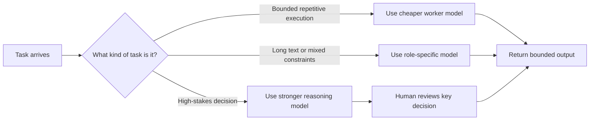

Current pricing makes the distinction concrete.

**Pricing snapshot date:** June 12, 2026.

| Provider / Model | Input / 1M | Output / 1M | Plain-language interpretation |
|---|---:|---:|---|
| OpenAI GPT-5.5 | $5.00 | $30.00 | **Expensive** on the API side. Good for high-value decisions. Too costly for routine repetition. |
| OpenAI GPT-5.4 mini | $0.75 | $4.50 | Lower-cost strong worker. More realistic for repeated coding subtasks. |
| DeepSeek V4 Pro | $0.435 | $0.87 | Cheap relative to premium frontier APIs. Good value for structured reasoning. |
| DeepSeek V4 Flash | $0.14 | $0.28 | **Very cheap** for repeated execution. |
| OpenCode Zen DeepSeek V4 Flash Free | Free | Free | Good for experimentation. Not the same as a stable production guarantee. |
| OpenCode Zen GLM-5.1 | $1.40 | $4.40 | Mid-tier to costly depending on output length. Better reserved for harder writing or reasoning tasks. |

The important point is **not** to memorize the table.


This kind of usage snapshot made the routing problem concrete.

It turned cost from a theory into an operational signal.

There is one more distinction worth making.

**OpenAI API pricing and ChatGPT Plus are not the same billing surface.**

- On the **API side**, you pay per token.
- On the **ChatGPT Plus side**, you pay a subscription fee and get access under **usage limits / quotas**.

As of this writing, the official ChatGPT pricing page says **Plus includes advanced reasoning with GPT-5.5 Thinking**, **expanded messages and uploads**, and **expanded Codex usage**, but it also states that **limits apply**.

So for this article, the practical takeaway is:

- **API expensive** = expensive every time you call it at scale
- **Plus convenient** = easier to access from the product side, but still constrained by quota and plan limits

The important point is to understand what the table means:

- a low-input model can still become expensive if output is long
- a premium model can still be worth it if the wrong decision is more costly than the API call

So I do not treat routing as a model popularity contest. I treat it as an analysis method.

Before assigning a model, I ask:

- Is this a **decision** task or an **execution** task?
- Is it **high-volume** or **occasional**?
- Is it **text-only** or **multimodal**?
- Is the failure cost low, medium, or high?

That is the core of this article.

This article is about **Opencode orchestration discipline**.

It covers:

- OpenCode usage patterns
- cost-aware routing
- subagent role separation
- multimodal input constraints
- MCP as infrastructure
- practical bugs that changed the workflow

It does **not** publish:

- confidential prompts
- sensitive internal review targets
- unpublished task-specific instructions

## A Concrete Example: My Coding Plan, Constraints, and Available Model Surface

Theory is easier to trust when it is attached to a real setup.

That is why I use my own coding plan as an example.

But I do **not** want to turn this article into a private configuration dump.

The better approach is:

- show one concrete setup
- extract the reasoning behind it
- turn that reasoning into a reusable method

### Historical Note: What I Actually Had in May 2026

By May 2026, I was not starting from a blank OpenCode environment.

I already had an early but usable experimental surface:

- **OpenAI via ChatGPT Plus OAuth**
  - used as a higher-trust route for orchestration or review
  - convenient from the product side
  - still constrained by **quota / limits**
- **DeepSeek API routes**
  - used as the practical workhorse for routine implementation and reasoning experiments
- **Volcengine Ark routes**
  - first reserved in configuration
  - then validated as a working execution path in early May
- **Manual agent splitting**
  - planning, implementation, deep reasoning, and review were already being separated
- **Command-based dispatch**
  - custom commands and explicit agent calls were already part of the workflow

So the May 2026 environment was already shaped by real constraints:

- some routes were **available but quota-limited**
- some were **cheap enough for repetition**
- some were **only partially stable**
- some had to be used through **manual routing rather than automatic trust**

That historical condition matters.

It explains why the workflow did not begin as a polished system.

It began as a constrained routing problem.

In my case, the routing plan was shaped by constraints:

- **token cost**
- **model availability**
- **free vs paid access**
- **plugin behavior**
- **interface friction**
- **long-text vs short-task workload**

This matters because a model surface is not the same as a routing plan.

For example:

- **OpenCode Go** is best understood as a curated subscription access layer
- **OpenCode Zen** is better understood as a wider pay-as-you-go and experimentation surface

That difference changes how I think about model assignment.

Why?

- A free model may be good for low-risk testing.
- It may still be a bad choice for stable production work.
- A bundled model may be convenient.
- It may still be the wrong fit for long-text drafting.
- A premium API may look expensive.
- It may still be the correct choice for a high-stakes planning decision.

So the coding plan is **not** a model ranking.

It is a **mapping discipline**.

When I read a model surface, I ask:

- Which models are **free**?
  - Standard meaning: they are available without direct per-token billing in the current product surface.
  - Plain-language meaning: I can try them without opening a separate API bill.
- Which are **subscription-bundled**?
  - Standard meaning: access is included inside a paid plan such as ChatGPT Plus, Go, or Pro, usually with usage limits.
  - Plain-language meaning: I already paid for access through the product, but I still cannot assume infinite usage.
- Which are **pay-as-you-go**?
  - Standard meaning: usage is billed directly by token or call volume through an API surface.
  - Plain-language meaning: every extra call can directly increase cost.
- Which are acceptable for **planning**?
  - Standard meaning: they are reliable enough for task decomposition, architectural judgment, and high-level decision-making.
  - Plain-language meaning: I trust them to decide what should happen next.
- Which are better for **bulk execution**?
  - Standard meaning: they are cheap and stable enough for repeated bounded tasks at higher volume.
  - Plain-language meaning: I can let them do many small jobs without worrying about cost every minute.
- Which are better for **long text**?
  - Standard meaning: they remain coherent and cost-reasonable when generating long explanations, reports, or drafts.
  - Plain-language meaning: they do not fall apart or become too expensive when the output gets long.
- Which are useful only for **experiments**?
  - Standard meaning: they are good enough for testing, comparison, or temporary exploration, but not yet trusted as stable production defaults.
  - Plain-language meaning: I can try them, but I should not build my whole workflow around them yet.

That is the transition I want this section to make clear.

I am not arguing for one perfect stack.

I am arguing for a repeatable analysis method:

1. **Classify the task**
2. **Estimate the failure cost**
3. **Estimate the call volume**
4. **Assign the model**

Once that method is explicit, the routing logic becomes much easier to justify.

## Development Stage I: The First Routing Attempts

Stage I was not about elegance.

It was about **making OpenCode usable under real constraints**.

The key questions were simple:
```
- Can one session support more than one model role?
- What should a **subagent** actually mean?
- How much should the main agent be allowed to delegate?
- What happens when the preferred model is unavailable?
```

Here, some terms need clear definitions.

- **Primary agent**
  - Standard meaning: the main interactive agent bound to the current tab or top-level session.
  - Plain-language meaning: the agent that sits in front and decides how the work should move.
- **Subagent**
  - Standard meaning: a delegated agent with a narrower role, narrower scope, or narrower permission set.
  - Plain-language meaning: a helper that does one smaller job instead of trying to do everything.
- **Fallback**
  - Standard meaning: an explicit backup route used when the preferred model or provider is unavailable, too expensive, or quota-limited.
  - Plain-language meaning: the backup plan that keeps work moving when the first route fails.
- **Permission boundary**
  - Standard meaning: the allowed action surface for an agent, such as edit, bash, or task delegation.
  - Plain-language meaning: the line that tells an agent what it is allowed to touch.

The first useful mental model looked like this:

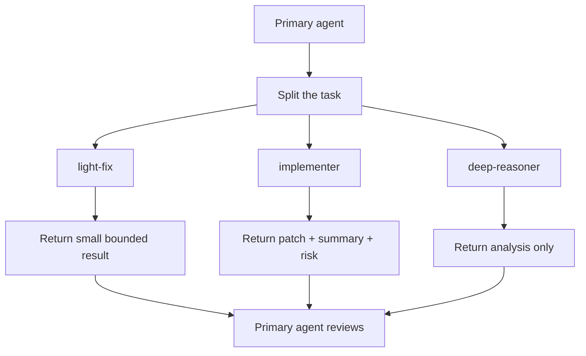

The main lesson was immediate.

**A subagent is useful only when its role is narrow.**

If a subagent is too abstract, it becomes another general chat box.

If it is narrow, it becomes operationally valuable.

In early testing, the role split started to make sense:

- **light-fix** for small bounded edits
- **implementer** for ordinary coding work
- **deep-reasoner** for analysis without editing
- **code-reviewer** for read-only review

That is also why the first configuration mattered.

It was not just a config file.

It was the first attempt to turn task categories into explicit agent roles.

**Git commit time:** 2026-05-04 10:03:45 +08:00

The original configuration also included routing sketches in comments.

That matters because it shows the routing logic was being documented **inside the config itself**, not only in external notes.

The earliest sketch in the config comments was literally structured like this:

```text
Main session = ChatGPT orchestrator (decompose, dispatch, review)
                   |
  -----------------+-----------------
  |                |                |
@light-fix     @implementer    @deep-reasoner
(L1 light)     (L2 normal)     (L3 deep reasoning)
Volcano Lite   DeepSeek V4     DeepSeek V4
                   |
                   v
             @code-reviewer
             final review
             ChatGPT
```

This can be visualized more faithfully **correct** like this:

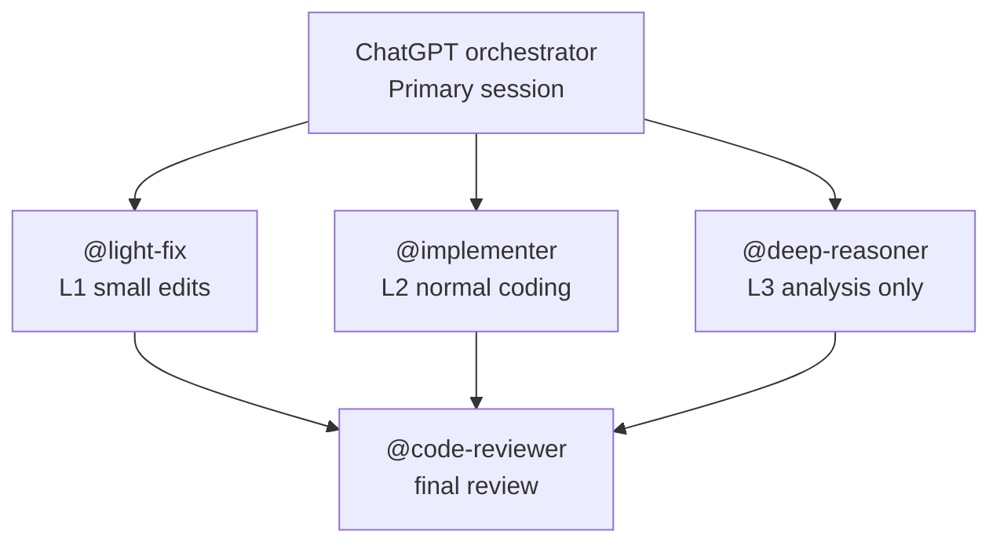

Plain-language meaning:

- one front agent splits the work
- each helper gets a narrower responsibility level
- the review route is explicitly separated
- in this earliest sketch, the reviewer is drawn downstream of the implementation path

Stage I also produced something else important:

**commands as stable entry points**.

This matters because a routing design is much easier to use when common actions have short, repeatable command surfaces.

In the initial configuration, this already existed.

**Git commit time:** 2026-05-04 10:03:45 +08:00

Abstracted command map:

```text
/review -> code-reviewer
/deep   -> deep-reasoner
/fix    -> light-fix
/impl   -> implementer
```

The command layer can be visualized like this:

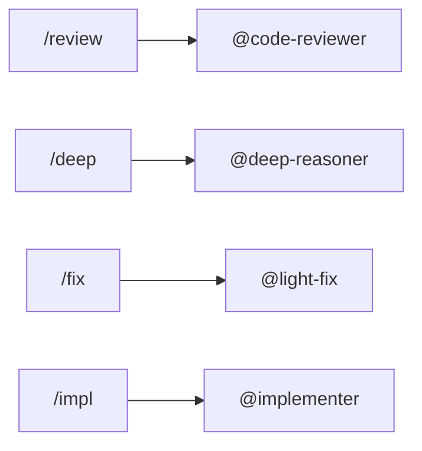

Plain-language meaning:

- commands turned repeated routing patterns into reusable shortcuts
- this reduced prompt overhead
- this also made the workflow more teachable to human operators

Later, the routing comments became even more explicit.

Instead of only listing agents, the config started to describe a **three-tier cost structure** and a **pipeline**:

```text
DeepSeek V4 Pro   -> deep reasoning and planning
DeepSeek V4 Flash -> fallback orchestration and fallback review
Volcengine Ark    -> high-frequency execution

Pipeline:
Ark reads context
  -> DeepSeek decides when needed
  -> Ark writes files cheaply
```

That second version matters because it moved the config comments from:

- “which agent exists”

to:

- **why each model tier exists**
- **which role belongs to which cost level**
- **how routing should flow in practice**

The command layer evolved more slowly.

That is also useful evidence.

The initial commit already contained the core commands.

Later commits mainly refined the surrounding routing logic, permissions, and fallback behavior.

Abstracted `opencode.jsonc` idea:

```jsonc
{
  "model": "openai/gpt-5",
  "default_agent": "orchestrator",
  "small_model": "deepseek/deepseek-chat",
  "agent": {
    "orchestrator": {
      "mode": "primary",
      "model": "openai/gpt-5"
    },
    "light-fix": {
      "mode": "subagent",
      "model": "volcengine-plan/ark-code-latest"
    },
    "implementer": {
      "mode": "subagent",
      "model": "deepseek/deepseek-v4-flash"
    },
    "deep-reasoner": {
      "mode": "subagent",
      "model": "deepseek/deepseek-v4-pro"
    },
    "code-reviewer": {
      "mode": "subagent",
      "model": "openai/gpt-5"
    }
  }
}
```

This block is **not** the raw file copied into the article.

It is a compressed `jsonc` abstraction.

Its job is to preserve the stable design idea from that commit.

What it preserves is:

- one visible primary orchestrator
- several narrower subagents
- early model-role separation
- review separated from ordinary implementation

What this meant in practice:

- GPT was positioned as the top-level coordinator
- cheaper or narrower models were already being assigned to execution roles
- deep reasoning and code review were already separated conceptually
- the workflow was no longer “one model does everything”

But the first version still had a problem.

It was too permissive.

It also assumed the preferred route would stay available.

That assumption did not survive real usage.

The next important change was therefore not “add more agents.”

It was **tighten boundaries and add manual fallback**.

**Git commit time:** 2026-05-08 09:19:02 +08:00

Abstracted `opencode.jsonc` idea:

```jsonc
{
  "agent": {
    "orchestrator": {
      "permission": {
        "task": {
          "deep-reasoner": "allow",
          "implementer": "allow",
          "light-fix": "allow",
          "code-reviewer": "allow",
          "code-reviewer-fallback": "allow"
        }
      }
    },
    "orchestrator-fallback": {
      "mode": "primary",
      "model": "deepseek/deepseek-v4-flash"
    },
    "implementer": {
      "steps": 6
    },
    "deep-reasoner": {
      "steps": 5
    },
    "code-reviewer-fallback": {
      "mode": "subagent",
      "model": "deepseek/deepseek-v4-flash"
    }
  }
}
```

This second block is also an abstraction.

It is here to show **what changed in the routing discipline**.

It is not meant to mirror every literal key from the historical file.

What it preserves is:

- explicit task permission boundaries
- visible fallback agents
- bounded reasoning depth
- the shift from “interesting setup” to “operationally safer setup”

This second step clarified several things.

- **Delegation should be explicit.**
  - Standard meaning: the primary agent should only be allowed to call known subagents.
  - Plain-language meaning: the main agent should not be free to dispatch anything to anywhere.
- **Fallback should be manual before it becomes automatic.**
  - Standard meaning: backup routes should first be operator-visible and operator-controlled.
  - Plain-language meaning: do not trust hidden auto-switching before you trust the backup path itself.
- **Reasoning depth should be bounded.**
  - Standard meaning: the number of reasoning steps or internal planning allowance should match the task.
  - Plain-language meaning: give hard tasks more room, but do not let every task think forever.

This was the real outcome of Stage I.

Not full automation.

Not elegant abstraction.

Just a much clearer operational rule set:

- one visible primary agent
- narrow subagents
- explicit permission boundaries
- manual fallback
- role-specific reasoning depth

That was enough to move from “interesting demo” to **repeatable working pattern**.

## Development Stage II: Multimodal I/O, Model Selection, and Interface Constraints

Stage II began when text-only routing stopped being enough.

At that point, the workflow had to handle:

- screenshots
- UI state
- error images
- mixed text + image analysis
- long structured outputs

### What Multimodal Actually Means

This is where **multimodal** stopped being a buzzword and became a configuration problem.

Here, the term needs a clear definition.

- **Multimodal**
  - Standard meaning: a model or route can accept or process more than one input type, such as text and images.
  - Plain-language meaning: you are no longer sending only words. You are sending words plus things like screenshots or other visual evidence.

### Transport Before Reasoning

OpenCode’s official config docs do not describe multimodality as philosophy.

They describe it through behavior.

The official config docs say OpenCode **normalizes image attachments before sending them to the model**. By default, images are resized when they exceed `2000x2000` pixels or `5242880` base64 bytes, and the relevant controls are `attachment.image.auto_resize`, `max_width`, `max_height`, and `max_base64_bytes`.

In practical terms, if an image is too large, OpenCode will try to shrink it; if it still cannot fit, the request may fail or the tool-result image may be omitted. So multimodal work is not only about which model can see images. It is also about **whether the image can fit through the route at all**.

That is the first Stage II lesson.

<span style="color: #2980b9;"><strong>Multimodal routing begins before reasoning.</strong></span>

It begins at the transport layer.

### Reading `opencode.jsonc` as a Modality Contract

The second lesson comes from the model surface itself.

In your own `opencode.jsonc`, several provider-model entries explicitly define:

- `modalities.input`
- `modalities.output`
- `limit.context`
- `limit.output`

For example, your Ark-side and Doubao-side multimodal routes use:

```jsonc
"modalities": {
  "input": ["text", "image"],
  "output": ["text"]
}
```

This is worth explaining in plain language:

- **`input: ["text", "image"]`** means the route accepts screenshots or other visual evidence together with instructions.
- **`output: ["text"]`** means the route can analyze the image, but it responds with text only.
- **`limit.context`** means how much combined input the lane can tolerate before context pressure becomes a problem.
- **`limit.output`** means how long the answer can grow before the route becomes constrained.

That means “multimodal” in practice is not a single checkbox.

It is a combination of:

- image acceptance
- text acceptance
- window size
- output ceiling
- image pre-processing rules

It is also tied to **quota** and **cache behavior**:

- **Quota** is the usage budget before the route starts limiting or stopping requests.
- **Context window** is how much combined material you can fit into one turn before the lane starts to break.
- **Cache hit** means repeated stable context can be cheaper than brand-new context.

### Quota, Context, and Cache

This matters because multimodal work often stresses all three at once.

- screenshots add payload
- screenshots usually come with explanation text
- image-grounded tasks often need longer outputs
- repeated visual tasks are often less cache-friendly than repeated text scaffolds

OpenCode Go makes the quota side very concrete.

The official Go docs define usage by **dollar limits**, not by a fixed number of prompts.

At the time of writing:

- **5 hour limit** = `$12`
- **weekly limit** = `$30`
- **monthly limit** = `$60`

The same docs explicitly note that **cheaper models allow more requests**, while **higher-cost models allow fewer**. In plain language, high-volume multimodal work burns through a costly lane quickly, while repetitive work lasts much longer on cheaper lanes.

Context pressure is the second side of the problem.

In your own configuration, routes vary a lot:

- some multimodal lanes are configured around `256000` context
- some long-text routes around `200000`
- some experimental DeepSeek routes reach `1024000`

The screenshot alone is rarely the whole problem. The real pressure is usually the screenshot plus explanation text, prior context, and an expected long answer.

That is why a route can be “multimodal-capable” and still be the wrong route.

Caching adds one more layer.

Official pricing surfaces expose this directly:

- OpenAI API pricing has a **cached input** column
- OpenCode Zen pricing has **cached read** and, for some models, **cached write**

This does **not** mean multimodal work automatically becomes cheap.

It means:

- repeated stable context can be discounted
- repeated unstable screenshots help much less
- reusable templates, stable instructions, and repeated task scaffolds benefit more from cache than constantly changing visual evidence

This is why route design matters.

- a long-text lane can benefit from repeated structure
- a coding lane can benefit from repeated repository context
- an image-troubleshooting lane often has weaker cache reuse because the visual evidence changes from task to task

This can be visualized like this:

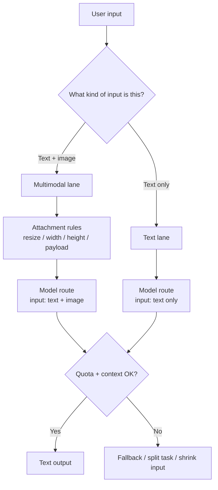

### Matching Task Form to Model Form

The next practical question is model choice.

A route can be multimodal and still be the wrong route.

That is why Stage II was not only about enabling image input.

It was about matching **task form** to **model form**.

The rough separation became clearer:

- **text-only long writing**
  - better assigned to a writer lane
- **image + text troubleshooting**
  - better assigned to a vision-text lane
- **ordinary implementation**
  - should stay on the execution lane unless visual evidence is required

### OpenCode Surfaces and Evidence Boundaries

This is also where the current OpenCode surfaces matter.

According to the official docs:

- **OpenCode Zen** is a broader pay-as-you-go gateway with both premium and limited-time free models
- **OpenCode Go** is a low-cost subscription surface for curated open coding models
- Go’s model list includes routes such as `GLM-5.1`, `Kimi K2.6`, `DeepSeek V4 Pro`, and `DeepSeek V4 Flash`
- Go usage is controlled by dollar-based limits, so cheaper models allow more requests

That wording is important.

I am deliberately saying **routes**, not **multimodal routes**.

Why?

Because a model appearing in a provider list does **not** prove that it accepts image input in the way this workflow needs.

This is also where source discipline matters.

For this article, I need to separate three kinds of evidence:

1. **Official model-provider docs**
2. **OpenCode Go / Zen docs**
3. **My own project config**

That separation matters because they do not prove the same thing.

For example, the DeepSeek routes discussed in this article should be described carefully.

- Based on the official DeepSeek API pricing/docs I relied on for this article, the DeepSeek routes I verified here are **reasoning / text routes**.
- Based on DeepSeek’s own Anthropic-compatibility guide, `content` blocks with `type="image"` are marked **Not Supported** in that compatibility table.
- Based on OpenCode Go docs, `DeepSeek V4 Pro` and `DeepSeek V4 Flash` appear as available Go models, but the Go page is describing **availability and pricing**, not proving a general image-analysis lane.
- Based on DeepSeek’s official `List Models` endpoint, the API can list model IDs, but that endpoint does **not** itself give a modality contract like `input: ["text", "image"]`.
- Based on my own `opencode.jsonc`, the multimodal lanes in this workflow were primarily defined through routes such as:
  - Ark-side models with `input: ["text", "image"]`
  - Doubao-side models with `input: ["text", "image"]`
  - later experimental image lanes such as `opencode/minimax-m3-free`

Plain-language meaning:

- **DeepSeek in this article should not be casually described as “the multimodal lane.”**
- In the evidence I verified for this workflow, DeepSeek was mainly a **reasoning / text route**.
- The actual multimodal behavior came from other lanes and from the way OpenCode was configured around them.
- OpenCode model lists are useful for discovery, but they are not the final truth for modality support.

The source hierarchy should look like this:

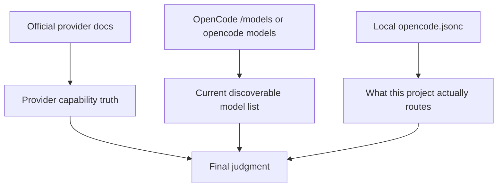

Plain-language meaning:

- **Provider docs** answer: can this API really accept image blocks, tool calls, long context, or cache?
- **OpenCode model list** answers: what models are currently visible from this provider connection?
- **Local config** answers: which of those models did I actually turn into working lanes in this project?

Plain-language meaning:

- Zen is useful when you want a wider experimental surface
- Go is useful when you want a curated and cheaper recurring surface
- neither one automatically solves multimodal routing by itself
- you still need to decide which tasks deserve image lanes and which do not

### Dedicated Lanes in Practice

This is where your own project configuration became more explicit.

The workflow gradually introduced dedicated lanes such as:

- **`vision-text-analyzer`**
  - for screenshots, UI states, image-grounded diagnosis, and mixed visual reasoning
- **`long-text-writer`**
  - for reports, blog drafts, and structured long-form output


This kind of trace showed that long writing had become a dedicated route.

It was no longer an accidental side effect of the main coding session.

That split is important.

It means multimodality was not treated as a global property of the whole system.

It was treated as a **lane-specific responsibility**.

That is a better design.

Why?

- not every task needs image capability
- image lanes often cost more attention and more context
- image lanes can fail earlier because of attachment constraints
- mixing visual and non-visual tasks in one route creates confusion

### Input Box Limits and OhMyOpenCode Practice

Another Stage II issue was the input box itself.

This sounds minor.

It is not.

- **Input box constraint** means the practical limit imposed by the interface on how users package instructions, files, and images into a single interaction. In practice, the box where you type changes how much you can safely stuff into one prompt before the workflow becomes messy.

This is where plugin behavior started to matter more.

OhMyOpenCode made the environment more powerful.

There was also a concrete config practice behind this.

**Git commit time:** 2026-06-03 18:38:09 +08:00

At that stage, the configuration started using **OhMyOpenCode `prompt_append`** so that agent system prompts could be loaded from `file://...` paths instead of being duplicated inline.

An abstracted `jsonc` shape looked like this:

```jsonc
{
  "plugin": ["oh-my-openagent@latest"],
  "agent": {
    "orchestrator": {
      "prompt_append": [
        "file://docs/opencode_strict_runtime.md",
        "file://.agents/skills/opencode-multi-agent-review-recorder/SKILL.md"
      ]
    }
  }
}
```

This snippet is also an abstraction.

It is **not** meant to claim that the current `opencode.jsonc` still looks exactly like this.

It is here to preserve the practical idea from that stage:

- the plugin was enabled explicitly
- prompt material stopped living only inside one giant inline config block
- agent guidance could be loaded from external files
- prompt organization became more modular and easier to revise

My later project config kept evolving beyond that point.

For example, the current project-level `jsonc` moved further toward:

- explicit provider blocks
- explicit agent role definitions
- explicit `command` routing
- explicit modality declarations

The **OhMyOpenCode phase** taught me how to externalize prompt instructions, and the **later project phase** pushed the config further into a routing-and-adapter document.

Installing OhMyOpenCode also made the **global vs project plugin boundary** more visible.

An abstracted relationship looked like this:

```text
~/.config/opencode/opencode.json
  -> machine-wide defaults
  -> plugin availability and user-wide preferences

<workspace>/opencode.jsonc
  -> project routing rules
  -> project agents, commands, providers, and local prompt discipline
```

Plain-language meaning:

- the global layer decides what is generally available on this machine
- the project layer decides how this repository actually wants to use it
- installing a plugin globally does not mean every project should inherit the same routing behavior unchanged

Plain-language meaning:

- the plugin was not only adding UI behavior
- it also changed how prompt instructions were organized
- long routing guidance could move into external files
- the config became less like a giant prompt box and more like an adapter layer

It also made one thing more obvious:

**UI affordances and routing logic are not the same thing.**

A plugin can improve the interface.

It can also introduce:

- automatic background behavior
- extra agent assumptions
- more complicated visible state
- more chances for the user to lose track of what route is actually running


Visible thinking helped with operator trust.

It did not replace routing discipline.

So the Stage II design lesson was simple.

Do not define multimodality only as “the model can see images.”

Define it as:

1. **Can the interface carry the input?**
2. **Can OpenCode normalize and pass the image?**
3. **Does the route explicitly accept text + image?**
4. **Does this task really need a multimodal lane?**
5. **Can the result still be reviewed by a human without confusion?**

That is what Stage II really clarified.

### How to Inspect Model and Modality Information

One more practical note helps here:

**you should inspect modality support instead of assuming it from the model name.**

Useful inspection methods include:

```bash
# 1. In the OpenCode TUI
/models
```

```bash
# 2. In the OpenCode CLI, list models from configured providers
opencode models
```

```bash
# 3. Narrow to one provider when needed
opencode models opencode
opencode models openai
opencode models deepseek
```

```bash
# 4. Inspect your local project config for modality declarations
rg -n '"modalities"|"input"|"output"|vision-text-analyzer' opencode.jsonc
```

```bash
# 5. Check OpenCode Zen model metadata
curl https://opencode.ai/zen/v1/models
```

```bash
# 6. Check OpenCode Go model metadata
curl https://opencode.ai/zen/go/v1/models
```

Plain-language meaning:

- do not guess from branding
- first check the provider docs for real capability
- then check `/models` or `opencode models` for discoverable model IDs
- then check the local config for actual routed lanes
- only then decide whether the lane is truly multimodal or only text-capable

One warning is necessary here.

- `/models` and `opencode models [provider]` are **discovery commands**
- they tell you what the current OpenCode connection can see
- they do **not** by themselves guarantee image support, cache behavior, or the exact input contract

### The Routing Rule

That leads to the routing rule I actually use:

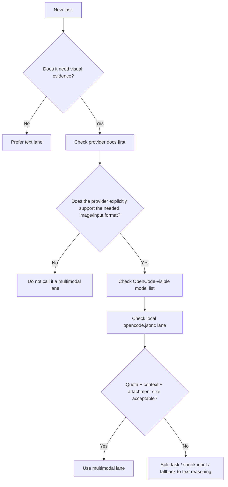

Plain-language meaning:

- **Not every image task deserves an image lane.**
- **Not every listed model deserves the label multimodal.**
- The safe rule is:
  - provider truth first
  - OpenCode discovery second
  - local routing third
  - quota and context check before execution

Not just model choice.

But the boundary between:

- visual input
- text routing
- plugin behavior
- and human control

## Development Stage III: MCP, Project-Level Truth, and Cross-IDE Reuse

Stage III began when routing was no longer the only problem.

At that point, the bigger question became:

**How should the same project tooling be reused across different coding-agent IDEs?**

This is where **MCP** finally became useful.

But only after Stage I and Stage II were already clear.

Why later?

Because MCP is not a magic fix for unclear routing.

If the task split is unclear, MCP only spreads confusion across more clients.

Here, the term needs a plain definition.

- **MCP**
  - Standard meaning: the Model Context Protocol, a standard way for AI clients to call external tools and services.
  - Plain-language meaning: a shared plug-in language for giving coding agents extra tools.

That definition is still too abstract by itself.

In practice, I had to separate **two different questions**:

1. **How should this project define its own reusable capability?**
2. **How should OpenCode, Claude Code, VS Code, Codex, or Trae connect to that capability?**

Those are not the same question.

That distinction is the real Stage III lesson.

### Tavily as the Example

I use **Tavily** as the cleanest example.

Why Tavily?

Because it exposes the architecture choice very clearly.

The core capability is simple:

- search the web
- extract useful content
- return structured results for later reasoning

But that same capability can be reached in more than one way.

In my own practice, three patterns appeared:

- **Pattern A: pure CLI script**
  - example: `search.mjs`
  - works anywhere with Node
- **Pattern B: mcporter subprocess**
  - example: a wrapper script that depends on `mcporter`
  - more IDE-bound
- **Pattern C: direct SDK**
  - example: `TavilyClient()`
  - works anywhere with Python

Plain-language meaning:

- the search capability is the real asset
- MCP is only one possible transport
- if the transport changes, the capability should still survive

That is why the Stage III question became:

**Do I want to build my project around Tavily itself, or around one IDE’s MCP convenience layer?**

The answer was clear.

I should build around the capability.

Not around the client.

### Project Truth vs Global Helper

This was the next important separation.

- **Project-level truth** is the configuration that defines what this repository actually uses.
- **Global helper** is a machine-wide convenience layer shared across projects, but not the repository's own truth.

In my setup, the project-level truth was:

- `<workspace>/config/mcporter.json`

And the global helper surface was things like:

- `~/.config/opencode/...`
- client-level convenience tools
- coordination utilities such as **CCSwitch**

That distinction matters because official tools do not load configuration the same way.

According to the official docs:

- **OpenCode**
  - has global config in `~/.config/opencode/opencode.json`
  - also supports project config in `<workspace>/opencode.jsonc`
  - project config has higher precedence among standard config files
- **VS Code**
  - supports workspace MCP config in `<workspace>/.vscode/mcp.json`
  - also supports user-profile MCP config
- **Claude Code**
  - supports project MCP through `.mcp.json`
  - also supports CLI loading through `--mcp-config`

In practical terms, every client has its own doorway, but the doorway is not the same as the project truth.

That is why the safest model looks like this:

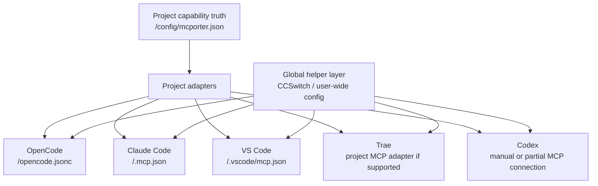

The point is simple: the project should describe the capability once, each IDE should get its own adapter, and global tools may help distribution without becoming the repository's only source of truth.

There is also a conservative operating rule behind this design.

I did **not** begin from the global layer.

I began from the project layer.

Why?

Because the safest order is:

1. make the project-level path pass
2. confirm the capability works in one repository
3. only then discuss machine-wide convenience

- **Project-level test first** means the repository-specific MCP path should pass here before any global rollout is trusted.
- **Global second** means machine-wide coordination is for reuse, not for guessing.

That rule exists for a practical reason.

If the project path is still uncertain, global setup only spreads uncertainty faster.

So my conservative principle is:

<span style="color: #2980b9;"><strong>project-level verification first, global coordination later</strong></span>

This can be visualized like this:

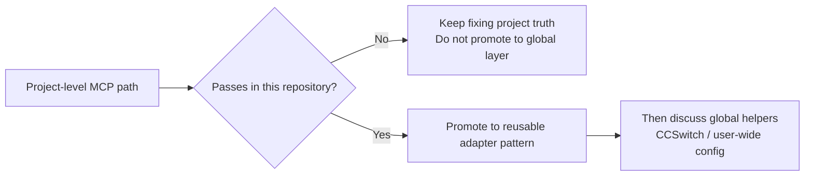

If the repository path has not passed, do not act as if the global story is ready. The global layer is a reuse layer, not the place where correctness should be invented.

### Why CCSwitch Matters

This is where **CCSwitch** becomes useful.

It is useful for the right reason.

Not the wrong one.

- **Right reason**
  - it helps manage or distribute MCP connections across clients
  - it reduces repeated per-client setup pain
- **Wrong reason**
  - treating it as the thing that defines the project itself

So I do **not** treat CCSwitch as the foundation.

I treat it as the **control panel**.

That means:

- project truth stays in the repository
- CCSwitch helps the machine-level connection story
- the project can outlive CCSwitch if another coordinator replaces it later

This is the key architectural point.

**CCSwitch is a global coordination utility, not a replacement for project design.**

### The Cross-IDE Reuse Rule

At this stage, the main question became:

**What is the most reusable unit across OpenCode, Claude Code, VS Code, Trae, and Codex?**

The answer was not “the prettiest MCP config.”

The answer was:

**the capability definition plus thin adapters**

For my own workflow, the practical rule became:

1. define the capability once
2. keep the project truth explicit
3. let each IDE adapt to it
4. keep global coordination replaceable

That rule can be visualized like this:

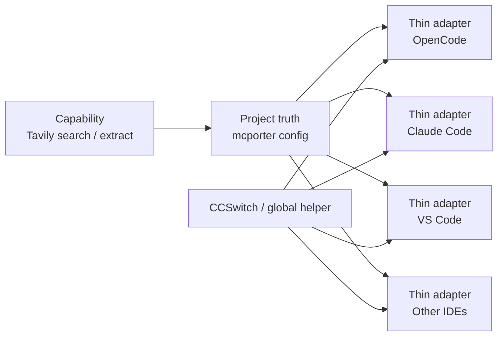

Plain-language meaning:

- **Tavily search** is the reusable thing
- **mcporter config** is the project’s declared contract
- **OpenCode / Claude / VS Code / Trae / Codex** are clients, not the truth
- **CCSwitch** helps coordination, but does not define the capability

### What Stage III Actually Changed

Stage III did not make the workflow more impressive.

It made it more durable.

The durable insight was this:

- MCP is useful as **infrastructure**
- not as the center of the story

It works best when:

- routing is already clear
- capability ownership is already clear
- project truth and global convenience are already separated

That is also why I would summarize Stage III like this:

**MCP is the connection layer.**

**It should not become the thinking layer.**

And for this project, the final practical rule became:

- capability first
- project truth second
- IDE adapter third
- global helper last

## Development Bugs: What Actually Broke and What Helped

This section matters for one reason.

**A real workflow is shaped by failure, not only by design.**

### ChatGPT Access, OAuth, and Proxy Friction

One recurring problem involved **ChatGPT model access**.

The issue was not simply “login failed.”

It was more layered than that:

- OAuth could succeed
- model listing could succeed
- real generation could still fail or timeout

This matters because those are different links in the chain: seeing models is not the same as getting a stable answer, and account access is not the same as reliable generation.

The practical solution was conservative: keep the proxy discussion brief, do not treat networking as the center of the article, but do record the operational lesson.

The lesson was:

- **verify the generation path, not only the login path**
- **treat proxy setup as an engineering dependency, not as proof of workflow stability**

In my own case, a process-level proxy path was more controllable than assuming one global route would always behave correctly.


This kind of rule made the workaround explicit.

It was not elegant, but it was testable.

That is why the workflow eventually favored:

- explicit fallback
- explicit role splitting
- and less dependence on one fragile access path

### Windows TUI Friction and Interaction Recovery

Another class of bugs came from the **TUI itself**.

This included:

- frozen or awkward input flow
- paste friction
- reduced visibility when the interface state became too busy

This sounds minor.

It is not.

Because orchestration depends on:

- seeing what route is active
- being able to paste structured instructions
- being able to recover quickly when the interface blocks you

One small practical example mattered:

- `Ctrl+Shift+V` became part of the recovery habit for paste/input flow in the Windows TUI path

A workflow can fail even when the model is good. If the interface is fighting the operator, the routing design loses value.

So the solution was not “trust the TUI more.”

It was:

- reduce prompt overload
- reduce context clutter
- keep commands short
- keep fallback routes explicit

### Provider Mismatch and Naming Errors

Another failure pattern was more architectural.

The routing logic could look correct on paper, but still fail in practice because:

- a provider was unavailable
- a model name was invalid
- a plugin expected an agent that was not actually registered
- a fallback was assumed but not explicitly defined

This is the boring kind of bug.

It is also one of the most important.

A beautiful routing idea is useless if the actual provider/model string is wrong.

That is why the workflow had to become stricter about:

- model discovery
- route naming
- explicit fallback agents
- explicit command-level fallback discipline

The practical lesson was simple:

<span style="color: #c0392b;"><strong>fallback should be designed, not imagined</strong></span>

### What These Bugs Changed

These bugs were not side notes.

They directly changed the final workflow.

They pushed the system toward:

- more visible routing
- more explicit backup paths
- less trust in silent auto-magic
- more human control at the points that actually fail

That is the real lesson.

**Bug pressure shaped the architecture.**

## Current Position: The Latest Compatible Strategy (My Practice)

By this point, the goal was no longer “find one perfect stack.”

The goal was:

**keep multiple useful layers compatible without losing project-level control**

### The Current Working Combination

The current direction is not one tool replacing everything.

It is a combination of:

- **OhMyOpenCode / agent-level enhancement**
- **existing routing discipline**
- **project-level MCP truth**
- **CCSwitch as optional global coordination**

Plain-language meaning:

- plugin layer helps the interface
- routing layer controls the work split
- MCP layer connects external tools
- global helper layer reduces repeated machine-wide setup

### Why Compatibility Matters More Than Purity

I do not think the best answer is a perfectly pure stack.

I think the better answer is a **compatible stack**.

That means:

- plugin behavior should not erase project routing rules
- project routing rules should not pretend to replace MCP
- MCP should not replace the project truth
- global coordination should not replace repository control

This can be visualized like this:

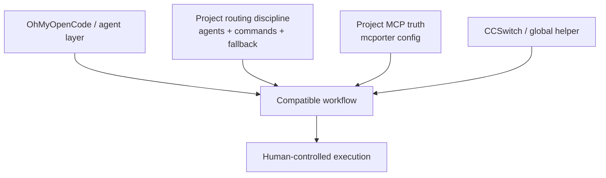

### The Latest `jsonc` Skeleton

At this point, the configuration can be described with a small abstract skeleton:

```jsonc
{
  // repository-level runtime discipline
  "instructions": ["docs/opencode_strict_runtime.md"],
  // top-level default route
  "model": "openai/gpt-5.5",
  "default_agent": "orchestrator",
  // provider family used by the project
  "provider": {
    "volcengine-plan": {
      "models": {
        // multimodal execution lane example
        "ark-code-latest": { "modalities": { "input": ["text", "image"], "output": ["text"] } },
        // long-text lane example
        "glm-5.1": { "modalities": { "input": ["text"], "output": ["text"] } }
      }
    }
  },
  // role-based routing surface
  "agent": {
    "orchestrator": {},
    "plan": {},
    "build": {},
    "implementer": {},
    "deep-reasoner": {},
    "long-text-writer": {},
    "vision-text-analyzer": {}
  },
  "command": {
    // lightweight edit entry
    "fix": {},
    // regular implementation entry
    "impl": {},
    // report-writing entry
    "write-experiment-report": {},
    // image-grounded analysis entry
    "analyze-image": {}
  },
  // actual MCP attachment points used in this project
  "mcp": {
    // local persistent memory server
    "memory": {},
    // project-local literature MCP, launched through stdio/node
    "fragmentgeneration-literature": {},
    // remote search MCP
    "exa": {},
    // remote search/extract MCP
    "tavily": {}
  }
}
```

This skeleton is not the full file.

It is meant to show the current design center:

- one strict instruction entry
- explicit providers
- explicit agents
- explicit commands
- explicit MCP attachment points

The MCP part above is still simplified, but it reflects the real categories I actually installed:

- **`memory`**
  - local persistent memory MCP
- **`fragmentgeneration-literature`**
  - project-local literature entry, started through a local Node script
- **`exa`**
  - remote search MCP
- **`tavily`**
  - remote search and extraction MCP

After installing OhMyOpenCode, the config was no longer just one file.

It became a layered relationship:

```jsonc
// global
{
  // ~/.config/opencode/opencode.json
  // machine-wide plugin availability
  "plugin": ["oh-my-openagent@latest"]
}

// project
{
  // <workspace>/opencode.jsonc
  // repository-specific routing and runtime discipline
  "instructions": ["docs/opencode_strict_runtime.md"],
  "default_agent": "orchestrator",
  "agent": {},
  "command": {},
  "mcp": {}
}
```

Plain-language meaning:

- the **global `jsonc`** is where plugin availability and machine-wide defaults live
- the **project `jsonc`** is where repository-specific routing and discipline live
- this separation is useful because one machine may host many projects, but each project may need different orchestration rules

### The Prompt Layer

The config structure above is only half of the story.

The other half is the **prompt layer**.

In practice, the workflow did not rely on one giant universal prompt.

It relied on several smaller prompt surfaces:

- **repository-level instructions**
  - for project rules and read/write discipline
- **agent-level prompts**
  - for role definition such as planner, implementer, reviewer, or long-text writer
- **command-level prompts**
  - for repeatable task entry points such as fix, implementation, experiment report writing, or image analysis

Plain-language meaning:

- the config says **who** should work
- the prompt says **how** that role should behave

An abstracted idea looked like this:

```jsonc
{
  "instructions": ["docs/opencode_strict_runtime.md"],
  "agent": {
    "orchestrator": {
      "description": "split tasks, route work, review final output"
    },
    "deep-reasoner": {
      "description": "analyze only, do not edit"
    },
    "implementer": {
      "description": "edit the target files and return patch + summary + risk"
    }
  },
  "command": {
    "fix": {
      "template": "Use the lightest valid route first. If that route fails because of provider or quota issues, use the explicit fallback."
    },
    "write-experiment-report": {
      "template": "Produce a structured report draft from verified evidence. Separate confirmed facts from reconstruction and unresolved gaps."
    },
    "analyze-image": {
      "template": "Separate visible facts from interpretation. Do not guess when the image is insufficient."
    }
  }
}
```

This is also an abstraction.

It is meant to preserve the practical prompt logic:

- prompts were split by responsibility
- commands carried reusable task discipline
- fallback behavior was described in prompt space as well as config space
- long tasks stopped depending on one oversized free-form message

That is why I do not think of prompts here as decoration.

I think of them as the **behavior contract** for each route.

### The Latest Directory Logic

The config story also became easier to understand as a directory story.

```text
<workspace>/
├── opencode.jsonc                  # OpenCode project routing
├── config/mcporter.json           # project-level MCP truth
├── .vscode/mcp.json               # VS Code adapter
├── .mcp.json                      # Claude Code adapter
├── .agents/skills/                # project-local skill layer
└── docs/                          # externalized runtime and prompt guidance
```

Plain-language meaning:

- project truth stays near the project
- client adapters stay visible
- long instructions do not have to live inside one config string

### The Main Practical Rule

If I compress the current position into one reusable rule, it is this:

**Use OhMyOpenCode where it helps. Keep the original routing discipline. Keep MCP project-first. Let CCSwitch help globally, but never replace the repository truth.**

That rule is not elegant in a theoretical sense.

It is better than elegance.

It is workable.

## References and Source Map

This article is based on two source classes:

- **official documentation**
- **internal experiment records**

They were not used for the same purpose.

### Official Documentation

The following official sources were used to support factual claims in this article:

- **OpenCode official docs**
  - [Config](https://opencode.ai/docs/config)
  - [Models](https://opencode.ai/docs/models)
  - [Providers](https://opencode.ai/docs/providers)
  - [Commands](https://opencode.ai/docs/commands)
  - [MCP servers](https://opencode.ai/docs/mcp-servers)
  - [CLI](https://opencode.ai/docs/cli)
- **OpenCode Go docs**
  - [Go](https://opencode.ai/docs/go)
- **OpenCode Zen docs**
  - [Zen](https://opencode.ai/docs/zen)
- **OpenAI official pricing**
  - [API Pricing](https://openai.com/api/pricing/)
- **DeepSeek official API docs**
  - [Models & Pricing](https://api-docs.deepseek.com/quick_start/pricing)
  - [List Models](https://api-docs.deepseek.com/api/list-models)
  - [Anthropic API Compatibility](https://api-docs.deepseek.com/guides/anthropic_api)
- **VS Code official MCP docs**
  - [Add and manage MCP servers in VS Code](https://code.visualstudio.com/docs/agent-customization/mcp-servers)
  - [MCP configuration reference](https://code.visualstudio.com/docs/copilot/reference/mcp-configuration)
- **Claude Code official docs**
  - [CLI reference](https://docs.anthropic.com/en/docs/claude-code/cli-reference)
  - [Claude Code settings](https://docs.anthropic.com/en/docs/claude-code/settings)
  - [Advanced setup](https://docs.anthropic.com/en/docs/claude-code/setup)

### Internal Experiment Reports Used as Evidence

The article is also grounded in repeated private experiment records.

These are listed here in **English translation only**.

They are included to show the article is based on repeated testing, not one-off opinion.

They are **not** included to disclose sensitive prompts or unpublished project content.

- **Experiment Report 2026-05-08: OpenCode Parallel Subagent Testing for Document-Code Alignment and Early Skill Prototyping**
- **Experiment Report 2026-05-21: OpenCode, ChatGPT OAuth, and TUN Troubleshooting Retrospective**
- **Experiment Report 2026-06-01-02: OpenCode Read-Cost Governance and Model Routing Troubleshooting**
- **Experiment Report 2026-06-03: Full-Protocol Field Layering, Document Contracts, Code Parallelism, and OhMyOpenCode**
- **Experiment Report 2026-06-05: From Domain Guardrails to MCP Multi-IDE Integration and AI Collaboration Infrastructure**


## Development Timeline Overview

This workflow did not appear fully formed.

It emerged in stages.

That timeline matters because it shows the system was shaped by repeated adjustment, not by a single theory.

### Timeline Summary

| Time | Stage | Key Change | Why It Mattered |
|---|---|---|---|
| 2026-05-04 | Initial OpenCode setup | Early subagent split: orchestrator, implementer, deep reasoner, reviewer | OpenCode stopped being treated as a single chat surface |
| 2026-05-08 | Routing discipline upgrade | Delegation boundaries tightened; fallback became explicit | The workflow became safer and more repeatable |
| 2026-05 | Cost-aware command layer | Commands became stable task entry points; model roles were separated by cost and failure impact | Repeated work no longer depended on one oversized free-form prompt |
| 2026-05 to 2026-06 | Long-text and multimodal specialization | Long-text writing and image-grounded analysis became dedicated lanes | Task form started to drive model and route selection |
| 2026-06-03 | OhMyOpenCode phase | Prompt material moved into external files and plugin-aware layering became visible | The config became easier to revise and less dependent on one inline prompt block |
| 2026-05 to 2026-06 | OAuth / TUI / access friction | Login success, generation stability, and interface usability were treated as separate engineering problems | Reliability was no longer inferred from partial success |
| 2026-06-05 | MCP and cross-IDE coordination | Project-level truth was separated from IDE adapters and global helpers | MCP became infrastructure instead of a buzzword |

### What the Timeline Proves

The workflow was not designed once and then applied.

It was revised under pressure from:

- cost
- routing failure
- interface friction
- plugin interaction
- cross-IDE reuse

That is why the final design is layered.

Each layer solved a different recurring problem.

## Conclusion

OpenCode became useful for me when it stopped behaving like one large prompt box.

It became useful when routing, fallback, prompt discipline, MCP boundaries, and human control were all made explicit.

That is the main lesson of this article.

<span style="color: #c0392b;"><strong>Stronger models should decide. Cheaper models should execute. Infrastructure should stay visible. Human control should stay real.</strong></span>
